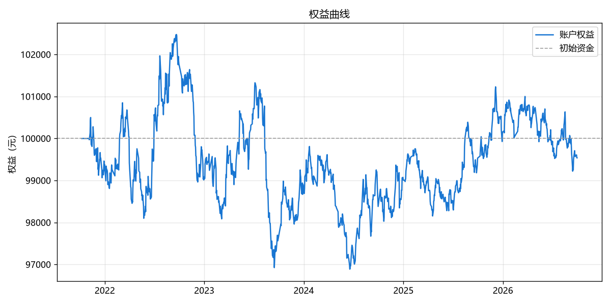
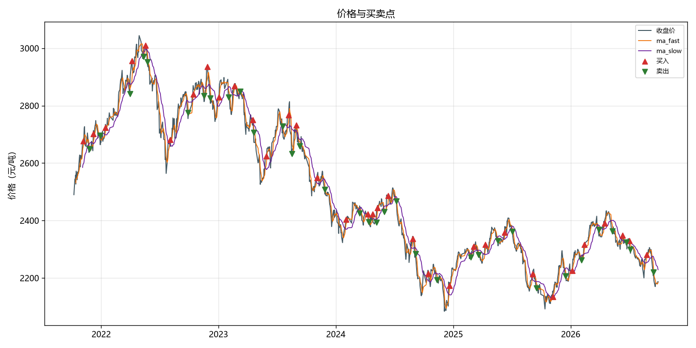
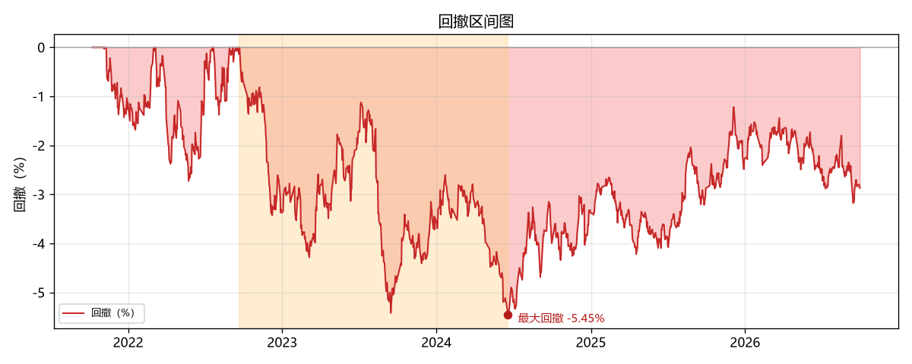
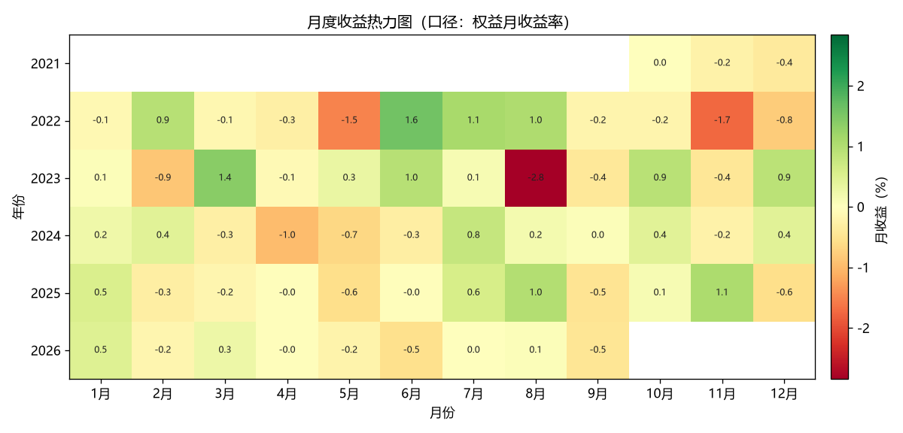
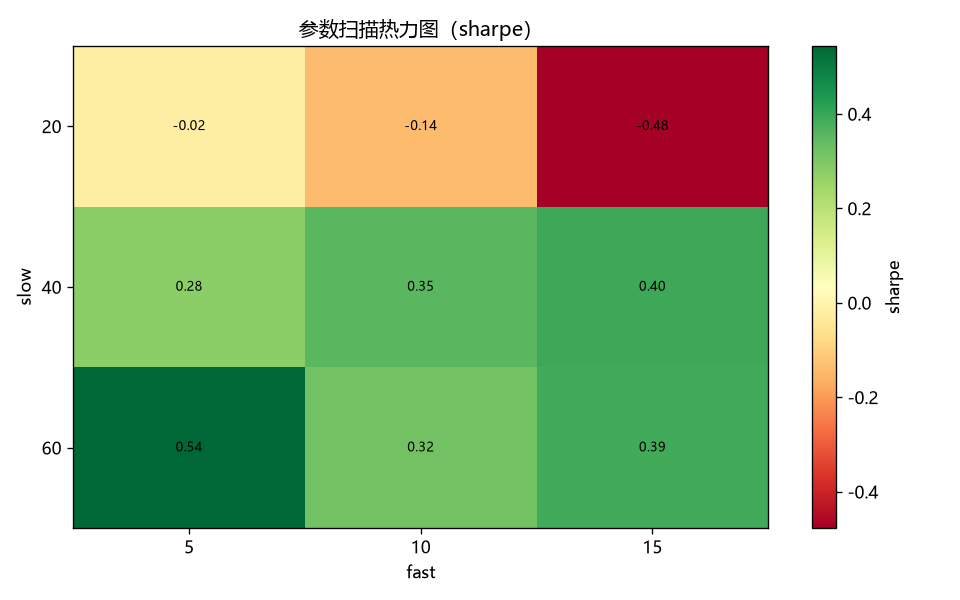

# quant-demo · 个人量化交易 Demo（期货回测最小闭环）


> 一个结构清晰、可一键运行、能产出专业回测报告的**个人期货量化研究项目**。
>
> 第一阶段目标：**回测最小闭环** —— 数据获取 → 清洗 → 策略 → 回测（含手续费/滑点）→ 绩效报告 → 参数对比。
>
> *A minimal, reproducible backtesting framework for China futures markets.*

---

## 项目截图

| 权益曲线 | 价格与买卖点 |
|:---:|:---:|
|  |  |

| 回撤区间图 | 月度收益热力图 |
|:---:|:---:|
|  |  |

| 参数扫描热力图 |
|:---:|
|  |

## 回测样例（可复现）

**玉米 C0 · 近 5 年日线（1211 根）· 双均线 fast=5 / slow=20 · 已计入手续费与滑点**

| 累计收益 | 年化 | 最大回撤 | 夏普 | 胜率 | 盈亏比 | 交易次数 | 累计手续费 | 累计滑点 |
| ---: | ---: | ---: | ---: | ---: | ---: | ---: | ---: | ---: |
| -0.46% | -0.10% | -5.45% | -0.02 | 35.8% | 0.97 | 67 | 162 元 | 1350 元 |

> 📌 这是一份**诚实**的样例：短周期均线在计入交易成本后并不赚钱（参数扫描中 fast=5 / slow=60 组合为 **+7.05%**，夏普 0.54）。
> 本项目的价值不是"暴利曲线"，而是**一套可复现、成本透明、可扩展**的量化研究框架。

> 📌 **组合样例（v1.2）**：8 品种 · 双均线(5/20) · 共享资金池 10 万 → 累计 **-98%**、保证金约束事件 1060 次。
> 这不是"引擎坏了"——框架如实呈现：该朴素策略组合在样本期本身就是亏损组合（独立回测口径合计 ≈ -9.1 万元），
> 共享资金池再叠加约束路径分歧（≈ -0.4 万元）。亏在哪（品种贡献）、被什么约束（事件日志）、品种间相关性（矩阵），一览无余。

---

## 快速开始

```powershell
# 1. 安装 uv（若已安装可跳过）
powershell -ExecutionPolicy ByPass -c "irm https://astral.sh/uv/install.ps1 | iex"

# 2. 克隆项目
git clone https://github.com/Eeyore104/quant-demo.git
cd quant-demo

# 3. 安装依赖（自动创建虚拟环境，锁定 Python 3.12）
uv sync

# 4. 一键跑通回测（首次联网拉数据，之后走本地缓存）
uv run python run_backtest.py

# 5. 组合回测（v1.2：8 品种 · 共享资金池 · 保证金约束）
uv run python run_portfolio.py
```

跑完在 `output/` 下得到：权益曲线图、买卖点图、回撤区间图、月度收益热力图、参数邻域热力图、蒙特卡洛对照图、成本敏感性图，以及绩效报告（含成本明细、**样本外验证对比表**与**过拟合体检**）。

组合模式（`run_portfolio.py`）另产出：组合权益与回撤 / 相关性矩阵 / 品种盈亏贡献 / 保证金占用 4 张图，组合报告与 3 个明细 CSV（逐日 / 逐品种 / 约束事件）。

参数对比 / 单元测试：

```powershell
uv run python scripts/run_param_scan.py   # 参数扫描 → 参数-绩效对比表 + 参数扫描热力图
uv run pytest                             # 单元测试
```

> 若提示 "uv 不是命令"：重开一个终端，或使用完整路径 `%USERPROFILE%\.local\bin\uv.exe`。

---

## 功能特性

- **数据层**：akshare 免费拉取期货日线；CSV 本地缓存（二次运行不联网）；自动清洗（去重 / 去无效 bar）
- **策略层**：统一策略接口 `StrategyBase` + **策略自动注册表**——新增策略只需在 `src/strategy/` 放一个新文件（内置双均线 / 布林带 / 唐奇安通道三个示例），引擎与入口**零改动**
- **引擎层**：自研轻量事件驱动回测引擎 —— T 日收盘出信号、T+1 开盘价 ± 滑点成交（**防未来函数**），内置手续费 / 滑点
- **组合引擎（v1.2）**：多品种并行 + **共享资金池**（保证金占用 / 可用资金不足拒绝开仓 + 事件日志）+ 逐日盯市；头寸规模三模式（固定 / 等权 / 波动率倒数）；组合报告含相关性矩阵、品种贡献与保证金占用曲线，一条命令产出（`run_portfolio.py`）
- **研究严谨**：内置**样本外验证**（训练段参数择优 → 测试段检验）+ **过拟合体检（v1.1）**——参数邻域细检（悬崖 / 孤峰）、蒙特卡洛对照（信号重排 + Bootstrap）、成本敏感性（收益归零倍数）、Deflated Sharpe 校正、样本外使用次数登记；报告输出逐项判定（通过 / 存疑 / 不通过）与总判定，主动暴露过拟合
- **报告层**：10 项绩效指标 + 权益曲线 / 买卖点 / 回撤区间 / 月度收益热力图 / 参数扫描热力图（PNG）+ 参数扫描对比表
- **预留执行层**：`ExecutionAdapter` 抽象接口 —— 未来接 SimNow 仿真 / CTP 实盘时，**策略代码不改**
- **工程化**：uv 依赖管理 · ruff 代码规范 · pytest 单元测试 · GitHub Actions CI · `config.yaml` 配置驱动（改参数不碰代码）

## 目录结构

```
quant-demo/
├── config/config.yaml      # 全部可调参数（品种/周期/策略/成本）
├── src/
│   ├── data/               # 数据层：akshare 拉取 / CSV 缓存 / 清洗
│   ├── strategy/           # 策略层：基类 + 双均线/布林带/唐奇安 + 自动注册表
│   ├── engine/             # 引擎层：单品种回测 / 组合引擎（v1.2）/ 撮合 / 持仓
│   ├── analysis/           # 研究体检：邻域 / 蒙特卡洛 / 成本敏感 / DSR（v1.1）
│   ├── report/             # 报告层：绩效 / 图表 / 体检 / 组合报告（v1.2）
│   ├── execution/          # 【预留】SimNow/CTP 实盘适配接口
│   └── utils/              # 配置加载 / 日志
├── scripts/run_param_scan.py   # 参数扫描入口
├── run_backtest.py             # ★ 单品种一键入口
├── run_portfolio.py            # ★ 组合入口（v1.2 · 8 品种 · 共享资金池）
├── tests/                      # 单元测试
├── docs/                       # 项目文档（背景 / PRD / 系统设计）
├── data/                       # 数据缓存（gitignore）
└── output/                     # 报告与图表（gitignore）
```

## 改成你自己的策略 / 品种

全部在 `config/config.yaml` 里改，不用动代码：

| 想改什么 | 改哪里 | 示例 |
|---|---|---|
| 换品种 | `data.symbol` | `C0`（玉米主连）→ `M0`（豆粕主连） |
| 换回测区间 | `data.start_date` / `end_date` | `2021-10-01` ~ `2026-10-01` |
| 换策略 | `strategy.name` | `dual_ma` / `bollinger` / `donchian` |
| 调参数 | `strategy.params` | 双均线 `fast: 5, slow: 20` |
| 调成本 | `backtest.commission_per_lot` / `slippage_ticks` | 手续费 1.2 元/手、滑点 1 跳 |
| 样本外分段 | `backtest.oos.split_date`（优先）/ `ratio` | `2024-10-01` 或 `0.7` |
| 参数网格 | `strategy.grid.<策略名>` | 参数扫描逐格遍历 |
| 组合品种池 | `portfolio.symbols` | 8 品种（代码 / 策略 / 参数） |
| 组合头寸规模 | `portfolio.sizing.mode` | `fixed` / `equal_weight` / `inv_vol` |

> 不知道有哪些品种可用？运行 `uv run python scripts/list_symbols.py` 查看全部 80+ 个主力连续合约（代码 / 名称 / 交易所）。

## 设计要点（为什么这么做）

- **成交约定（防未来函数）**：T 日收盘产生信号，T+1 日开盘价 ± 滑点成交
- **自研轻量回测引擎**：bar 推进 / 撮合 / 成本逻辑全部可查、可讲；与未来 CTP 实盘
  共用同一策略接口（见 `src/execution/base.py` 预留的 ExecutionAdapter）
- **数据可离线复用**：`data/raw/` 缓存原始数据、`data/clean/` 缓存清洗结果，
  二次运行不重复联网
- **成本必计入**：报告明确打印累计手续费与累计滑点，回测结论不虚高

## Roadmap

- [x] **M1–M5 回测最小闭环**（作品集级）：数据 → 策略 → 回测 → 报告 → 参数对比
- [x] **v1.0 交付级完善**：CI / License / 代码规范 / 样本外验证 / 参数扫描热力图 / 唐奇安策略（多策略自动注册）
- [x] **v1.1 研究体检补全**：过拟合四件套（参数邻域 / 蒙特卡洛 / 成本敏感性）+ Deflated Sharpe 校正 + 样本外使用次数登记
- [x] **v1.2 组合引擎**：多品种并行 + 共享资金池（保证金约束 + 拒绝开仓事件）+ 组合报告（相关性 / 贡献 / 保证金占用）
- [ ] **M6–M7 研究平台化 + 仿真**：本地数据库、SimNow 模拟盘接入
- [ ] **M8–M9 Web 看板 + 实盘准备**：可视化看板、风控模块、程序化交易报备后小资金实盘

## 合规提示（重要）

- 当前阶段仅为**本地回测研究**，不涉及实盘，无合规风险
- 未来接实盘前：需开立期货账户，且**程序化交易必须先向期货公司报备、收到确认后**
  才能实盘交易（《期货市场程序化交易管理规定（试行）》，证监会公告〔2025〕12 号）
- 详见 `docs/01-量化背景与前置需求.md` 第 4 章「合规必读」

## 项目文档

| 文档 | 内容 |
|---|---|
| `docs/01-量化背景与前置需求.md` | 背景科普、路径对比、SimNow 科普、合规必读、前置需求 |
| `docs/02-PRD.md` | 产品需求、验收标准、里程碑 |
| `docs/03-系统设计与任务分解.md` | 架构设计、数据模型、任务分解、落地路线 |
| `docs/04-增量PRD-v1.0.md` | v1.0 增量产品需求 |
| `docs/05-增量设计与任务列表-v1.0.md` | v1.0 增量系统设计与任务分解 |
| `docs/06-验收报告-v1.0.md` | v1.0 QA 验收报告（含 Round 2 复验） |
| `docs/07-框架补齐路线图.md` | v1.1 → v2.0 框架补齐路线图（版本序 / 验收线 / 待确认清单） |
| `docs/08-增量设计与任务列表-v1.1.md` | v1.1 研究体检增量设计 |
| `docs/09-验收报告-v1.1.md` | v1.1 QA 验收报告（含 CI 复验） |
| `docs/10-增量设计与任务列表-v1.2.md` | v1.2 组合引擎增量设计 |

## 许可证

本项目采用 **MIT License**，版权署名 `2026 Eeyore104`，详见 [`LICENSE`](LICENSE)。

## 常见问题

- **图表中文乱码**：已默认使用 Microsoft YaHei；若系统无此字体，改
  `src/report/plotter.py` 顶部字体列表
- **PowerShell 激活虚拟环境报错**：可跳过激活，直接用 `uv run <命令>` 运行
- **想加数据源（如 tushare）**：在 `src/data/loader.py` 的扩展位加实现即可，
  上层不感知
