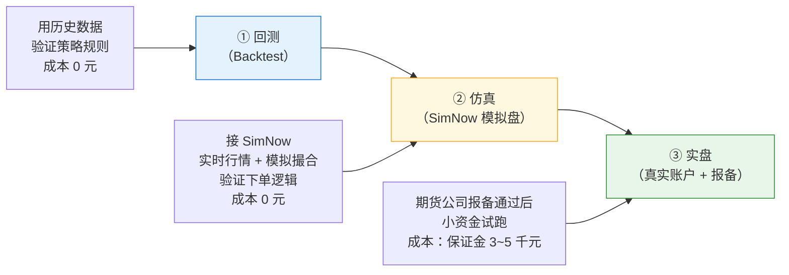
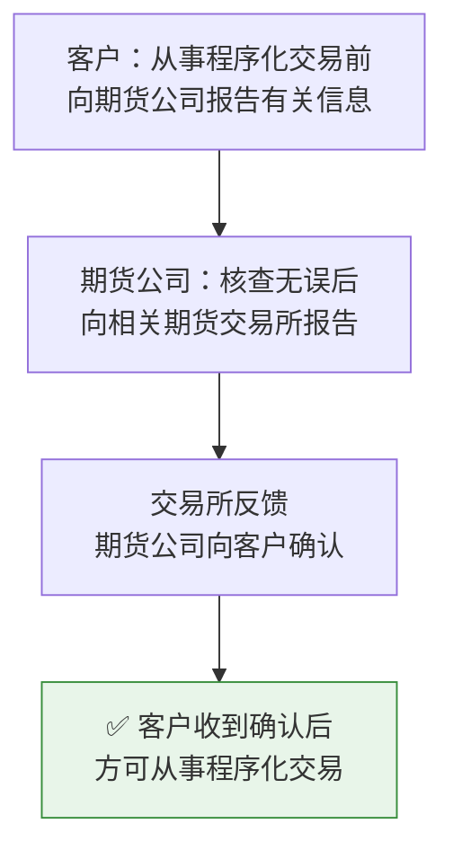

# 01 量化交易背景与前置需求

> **文档类型**：项目前置研究 / 背景说明  
> **项目**：个人量化交易 Demo（quant-demo）  
> **目标读者**：项目所有者（个人开发者，Java 背景 + Python 基础，量化零基础）  
> **编写日期**：2026-10-08  
> **写作原则**：全中文 · 结论先行 · 大白话 + 生活类比 · 表格对比  
> **合规依据**：《期货市场程序化交易管理规定（试行）》（证监会公告〔2025〕12 号），2025-06-13 发布、2025-10-09 施行，现行有效

---

## 0. 一页速览（结论先行）

| 问题           | 一句话答案                                                 |
| ------------ | ----------------------------------------------------- |
| 量化是什么？       | 把"凭感觉买卖"变成"按写好的规则自动买卖"，并且**能拿历史数据验证这条规则过去赚不赚钱**       |
| 个人做量化，选哪个市场？ | **中国期货 + CTP 通道**（SimNow 免费仿真起步），理由见第 2 章             |
| 要花多少钱？       | 学习和回测阶段**几乎 0 成本**；实盘先拿 3000~5000 元做低保证金品种（玉米/甲醇）即可试水 |
| 最大的"坑"是什么？   | 不是技术，是**合规报备**——程序化交易必须先向期货公司报告、收到确认后才能实盘             |
| 本项目先做什么？     | **回测最小闭环 MVP**：能拉到数据、跑通 1~2 个经典策略、出一张带指标的绩效报告         |
| 量化能保证赚钱吗？    | **不能**。它的价值是"规则化、可回测、可复盘"，不是"印钞机"                     |

---

## 1. 量化交易是什么

### 1.1 大白话定义

**量化交易 = 用写好的电脑程序，代替人脑的"看着盘凭感觉下单"。**

生活类比：

- **主观交易**像"老司机凭经验和路感开车"——灵活，但容易情绪化、会疲劳、说不清楚为什么。
- **量化交易**像"自动驾驶 + 行车记录仪"——先把"见红灯刹车、见绿灯加油"写成规则，让电脑执行；每次跑完还能回放录像复盘"这条规则在过去的路上表现如何"。

### 1.2 量化 vs 主观交易

| 维度   | 主观交易        | 量化交易                |
| ---- | ----------- | ------------------- |
| 决策依据 | 经验、盘感、消息、情绪 | 明确的数学规则 / 指标 / 模型   |
| 执行方式 | 人工手动下单      | 程序自动生成并下达指令         |
| 可复现性 | 差（每次都不同）    | 强（同一规则结果一致）         |
| 验证方式 | 靠"事后感觉"     | 靠**历史回测**（拿过去数据跑一遍） |
| 主要风险 | 情绪失控、追涨杀跌   | 模型过拟合、程序 Bug、极端行情失效 |
| 人的角色 | 全程盯盘        | 前期研究规则，后期维护系统       |

### 1.3 主要流派（知道有这些就行，本 Demo 只做最简单的一类）

| 流派       | 核心思路                   | 生活类比        | 对个人友好度      |
| -------- | ---------------------- | ----------- | ----------- |
| **趋势跟踪** | 涨了就跟着买，跌了就跟着卖（如双均线）    | 顺风骑车省力      | ⭐⭐⭐⭐⭐ 最适合入门 |
| 统计套利     | 找两个"通常会同步"的品种，价差拉大就反向做 | 跷跷板两头总会回归平衡 | ⭐⭐⭐ 需要较多数学  |
| 均值回归     | 价格偏离常态太远就反向押注          | 橡皮筋拉太长会弹回   | ⭐⭐⭐         |
| 高频交易     | 用极快速度赚微小价差             | 超市找零速度战     | ⭐ 机构专属，个人别碰 |

> 本 Demo 首选 **趋势跟踪类（双均线、布林带）**，因为逻辑简单、数据要求低、容易讲解——非常适合作为"能力作品集"。

### 1.4 个人量化 vs 机构量化

| 维度   | 个人开发者                 | 机构                   |
| ---- | --------------------- | -------------------- |
| 资金   | 几千 ~ 几十万              | 千万 ~ 百亿              |
| 数据   | 免费源（akshare 等）        | 付费专线、TICK/Level-2 数据 |
| 速度   | 秒级 / 分钟级足够            | 微秒级竞赛                |
| 团队   | 1 人全包                 | 研究/开发/风控/运维分工        |
| 优势   | 灵活、船小好调头、无业绩压力        | 资金、数据、算力、合规通道        |
| 打法建议 | **不做速度，做"耐心持有的低频策略"** | 高频、大容量策略             |

**结论**：个人量化的正确心态不是"和机构拼刺刀"，而是"用一套自己能懂的规则，稳定地做小资金实验，并把它做成一份能展示能力的产品"。

### 1.5 预期管理（很重要，务必先读）

- ❌ 量化 **不等于** 稳赚，也不是"AI 预测涨跌"。
- ✅ 量化的核心价值：**规则化**（不靠情绪）、**可回测**（能否赚钱先验证）、**可复盘**（每笔交易有据可查）。
- ⚠️ 回测赚钱 ≠ 实盘赚钱。常见原因：过拟合、手续费/滑点没算、历史不会简单重演。
- 🎯 本项目第一阶段的目标是**"跑通闭环、做出漂亮的回测报告"**，而不是"立刻赚钱"。

---

## 2. 国内个人量化可行路径对比

| 维度       | **期货（CTP 通道）**                   | 券商 A 股通道                      | 加密货币                  | 零售外汇保证金                 |
| -------- | -------------------------------- | ----------------------------- | --------------------- | ----------------------- |
| 开户门槛     | 低：线上 15~30 分钟，普通商品期货**无资金门槛**    | 低：线上开户即可                      | 极低：注册交易所账户            | 低，但**国内无合法零售平台**        |
| 程序化实盘可行性 | ✅ 高：CTP 是行业标准接口，官方仿真环境（SimNow）免费 | ⚠️ 中：个人难拿到合规的程序化接口（多需机构/量化权限） | ✅ 高：API 开放            | ⚠️ 技术上可行但非法渠道           |
| 合规风险     | ✅ 低：路径清晰，**报备后合规**（见第 4 章）       | ✅ 低                           | ❌ 高：境内交易不受法律保护、出入金有风险 | ❌ **极高**：境内零售外汇保证金交易属非法 |
| 数据可得性    | ✅ 好：akshare/tushare 免费拿到日线、分钟线   | ✅ 好：A 股数据最丰富                  | ✅ 好：交易所 API           | ⚠️ 差                    |
| 学习曲线     | 中：需懂 CTP、报备、保证金/杠杆               | 中                             | 中                     | 高且无正规资料                 |
| 交易机制     | T+0、双向、杠杆（保证金）                   | T+1、单向为主                      | T+0、双向、高杠杆            | 高杠杆                     |
| **综合结论** | ⭐⭐⭐⭐⭐ **最优主线**                   | ⭐⭐⭐ 备选（受限）                    | ⭐ 不建议（风险高）            | ❌ 排除（不合法）               |

### 为什么"期货 CTP"是最优主线（3 条理由）

1. **通道正规且对个人开放**：CTP 是国内期货行业统一的交易接口标准，SimNow 提供官方免费仿真环境，行情和撮合规则与实盘一致——**学习和验证零成本**。
2. **合规路径清晰**：程序化交易报备制度明确（第 4 章），只要走完报备流程就能合规实盘，不存在"灰色地带"。
3. **数据免费可拿**：日线、分钟线都能用 akshare 免费获取，足以支撑趋势跟踪类策略的回测。

---

## 3. 期货 CTP 与 SimNow 科普

### 3.1 CTP 柜台是什么

**CTP（Comprehensive Transaction Platform，综合交易平台）** 是上期技术（上海期货信息技术有限公司）开发的期货交易系统，是**国内期货行业事实上的标准柜台**。

生活类比：把期货交易所想成"高速公路"，CTP 就是所有车都必须走的"统一收费站 + 入口闸机"。无论你用哪家期货公司，背后的交易通道基本都是 CTP。

对程序员的意义：

- 它对外提供了一套**标准的 API 接口**（C++ 为主，Python 通过封装库调用）。
- 只要对接了 CTP，理论上就能对接几乎所有国内期货公司的账户——**一次学习，处处可用**。

### 3.2 SimNow 是什么

**SimNow（simnow.com.cn）** 是上期技术运营的**官方免费期货仿真平台**。

| 项目    | 说明                                   |
| ----- | ------------------------------------ |
| 运营方   | 上期技术（上期所全资子公司），官方性质                  |
| 费用    | **免费**                               |
| 行情与撮合 | **和实盘一致**（不是"随便玩玩"的模拟盘）              |
| 注册方式  | 手机号注册（建议用移动/联通号，白天交易时段注册更稳）          |
| 必要操作  | 注册后**必须修改密码**                        |
| 双环境   | "看穿式"环境（模拟真实开户，更规范）与 "7×24" 环境（全天可测） |
| 资金    | 可入金 / 可重置资金（输光了能重置，练习无压力）            |
| 已知限制  | 仿真环境**不支持市价单**等部分委托类型                |

> SimNow 的价值：**让你在没有真金白银、不违反任何规定的前提下，把"程序下单"这件事完整跑通一遍。**

### 3.3 "回测 → 仿真 → 实盘"全流程示意

**三步走口诀**：

1. **回测**：过去赚不赚钱？（用历史数据）
2. **仿真**：程序下单逻辑对不对？（用 SimNow）
3. **实盘**：用真钱小仓位试。（报备通过后）

### 3.4 关键限制与常见坑（提前避雷）

| 坑          | 说明                            | 应对                      |
| ---------- | ----------------------------- | ----------------------- |
| 主力合约"换月跳空" | 主力连续合约在切换合约时会留下价格跳空，直接回测会虚增收益 | 回测时注意换月处理，或先用单合约验证      |
| 免费数据需清洗    | 免费源偶尔重复行、含 0 成交量的"僵尸 bar"     | 回测前做去重、去无效 bar          |
| 手续费 / 滑点没算 | 回测里不计交易成本，结果会过于乐观             | 回测引擎必须计入手续费与滑点          |
| 过拟合        | 参数调到"历史完美"，换到实盘就失效            | 参数别调太细，留样本外验证           |
| 仿真 ≠ 实盘    | 仿真没有真实滑点和流动性冲击                | 仿真只验证"逻辑对不对"，不验证"能不能赚钱" |
| 用错环境       | SimNow 分"看穿式/7×24"两套环境，连错连不上  | 记录并区分两套环境的账号/前置地址       |

---

## 4. 合规必读：程序化交易报备制度

> **一句话**：在中国做期货程序化交易**不违法**，但**必须先报备、后交易**。这一步不能省。

### 4.1 法律依据

- **《期货市场程序化交易管理规定（试行）》**
- 文号：证监会公告〔2025〕12 号
- 发布：2025-06-13 ｜ 施行：2025-10-09 ｜ 现行有效

**程序化交易的定义**：通过计算机程序自动生成或者下达交易指令在期货交易所进行期货交易的行为。  
（→ 只要你是"程序自动下单"，就属于程序化交易，就要报备。）

### 4.2 报备路径（三步走）

> **红线**：**没有收到期货公司确认，就不能实盘跑程序化交易。** 仿真（SimNow）阶段不受此限，可放心练习。

### 4.3 需要报告的内容

| 类别             | 具体项                                                       |
| -------------- | --------------------------------------------------------- |
| **账户基本信息**     | 交易者名称、交易编码、委托的期货公司等                                       |
| **交易和软件信息**    | 交易指令执行方式、交易软件名称 / 基本功能 / 开发主体等                            |
| **交易所要求的其他信息** | 按交易所要求补充                                                  |
| **高频交易额外项**    | 交易策略类型及主要内容、最高报撤单频率、单日最高报撤单笔数、服务器所在地、技术系统测试报告、应急方案、风险控制措施 |

### 4.4 系统接入要求

- 客户用于程序化交易的技术系统**接入前，须由期货公司自行或委托第三方进行测试**。
- **不得将客户技术系统直接接入交易所交易系统**（必须经过期货公司这一层）。

### 4.5 个人参与红线清单

| # | 红线               | 说明              |
| - | ---------------- | --------------- |
| 1 | ❌ 未报备就实盘         | 必须先报备、收到确认      |
| 2 | ❌ 绕过期货公司直连交易所    | 技术上和合规上都禁止      |
| 3 | ❌ 未经测试直接上生产      | 技术系统须先经期货公司测试   |
| 4 | ❌ 隐瞒高频特征         | 高频需额外报告，不能装普通程序 |
| 5 | ❌ 做零售外汇 / 境外非法平台 | 不受境内法律保护        |
| 6 | ❌ 用他人账户或代客理财     | 涉嫌违法违规          |

> ✅ **安全参与方式**：学习/回测用本地 → 模拟用 SimNow（免费合规）→ 实盘前通过期货公司走完报备流程。

---

## 5. 前置需求清单

> 说明：「当前状态」以本项目用户（22 岁个人开发者、预算敏感）为默认假设；费用为**量级估算**，标注了估算依据。

| # | 需求项       | 当前状态              | 需要什么                             | 怎么获得                                            | 费用量级                                         |
| - | --------- | ----------------- | -------------------------------- | ----------------------------------------------- | -------------------------------------------- |
| 1 | **账户**    | 无                 | 期货账户（实盘）+ SimNow 账号（仿真）          | 实盘：线上开户 15~30 分钟，无资金门槛；仿真：SimNow 手机号注册          | 开户 **0 元**                                   |
| 2 | **资金**    | 未定                | 实盘最低保证金（低门槛品种）+ 期货公司加收           | 玉米/甲醇约 2000~2400 元/手；螺纹钢约 3400~4100 元/手       | 实盘试水 **3000~5000 元**（低门槛品种 1~2 手）；仿真 **0 元** |
| 3 | **数据**    | 无                 | 期货日线（主力连续/单合约），后期加分钟线            | akshare（免费）为主，tushare 为辅                        | **0 元**（tushare 高级接口约需 500 元买 5000 积分，可选）    |
| 4 | **软件与环境** | Python 基础，环境配置偏新手 | Python + 数据分析/回测库 + 代码编辑器        | 逐步安装：Python、pandas、akshare、matplotlib 等（详见架构文档） | **0 元**（全开源）                                 |
| 5 | **知识储备**  | 量化零基础             | 期货基础概念（保证金/杠杆/多空/换月）、经典策略原理、回测常识 | 边做边学；本项目文档 + 经典教材                               | 时间成本为主                                       |
| 6 | **时间投入**  | 需评估               | MVP 开发 + 学习                      | 建议按周推进（见 PRD 里程碑）                               | MVP 预计 **2~4 周** 业余时间                        |

### 费用补充说明

- **保证金**会随合约价格和交易所规则变化，期货公司通常会在交易所基础上**加收 3%~8%**（可与客户经理协商降低）。
- 表内保证金数字为 **2025 年下半年市场行情下的估算区间**（玉米约 2155~2250 元/手、甲醇约 2000~2376 元/手、螺纹钢约 3400~4118 元/手），实际以下单时为准。
- 数据接口现状（**2026-10 检索**）：
  - **akshare**：免费、无需积分，`futures_zh_daily_sina` / `futures_main_sina` 可取主力连续日线，`futures_hist_em` 支持任意时间段、回溯 10 年以上。**本项目数据首选。**
  - **tushare**：免费接口有限制（约每分钟 80 次、每天 500 次），期货日线接口 `fut_daily` 需 **2000 积分**；约 5000 积分可解锁大部分数据（1 元 ≈ 10 积分）。

---

## 6. 待确认问题（需用户拍板）

| #  | 问题                          | 影响           | 建议默认值                         |
| -- | --------------------------- | ------------ | ----------------------------- |
| Q1 | 第一阶段是否只做**回测**，暂不碰仿真/实盘？    | 决定 MVP 边界与工期 | 建议：是（先闭环，后扩展）                 |
| Q2 | 回测标的品种选哪个？                  | 影响数据与参数      | 建议：玉米（C）或甲醇（MA），保证金低、流动性好     |
| Q3 | 回测周期多长？                     | 影响数据量与结论可信度  | 建议：近 5 年日线                    |
| Q4 | 数据源用 akshare 还是 tushare？    | 影响成本与稳定性     | 建议：akshare 为主（免费），tushare 作备份 |
| Q5 | 是否需要 Web 界面，还是先出命令行 + 图片报告？ | 影响工作量        | 建议：MVP 先命令行 + PNG 图，Web 放 P2  |
| Q6 | 回测结果是否计入手续费与滑点？             | 影响结论真实性      | 建议：**必须计入**                   |
| Q7 | 是否有实盘计划与时间表？（涉及报备）          | 决定何时启动报备流程   | 建议：MVP 完成后再评估                 |
| Q8 | 每周可投入时间约多少小时？               | 影响里程碑排期      | 待用户确认                         |

---

> 本文档为项目前置研究资料，数据与法规信息检索截止 **2026-10-08**。后续如有法规/接口变更，以官方最新公告为准。
