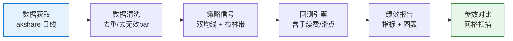

# 02 产品需求文档（PRD）——个人量化交易 Demo

> **文档类型**：简单 PRD（MVP 导向）
> **项目名称**：quant_demo（quant-demo）
> **编写日期**：2026-10-08
> **关联文档**：`01-量化背景与前置需求.md`
> **适用范围**：第一阶段「回测最小闭环 MVP」

---

## 一、项目信息

| 项目 | 内容 |
|---|---|
| 项目名称 | quant_demo |
| 开发语言 | **Python 主导**（数据分析 / 回测）；Web 看板阶段可引入前端 |
| 运行环境 | Windows 笔记本（联想 R7000），个人开发者本机 |
| 目标市场 | 中国期货（CTP 通道；SimNow 免费仿真起步） |
| 交付形态 | 可一键运行的 Python 项目 + 回测报告（图片/文本），后续扩展 Web 看板 |
| 原始需求复述 | 个人开发者想用 Python 做量化交易，先做出一个"回测最小闭环"，作为求职/能力作品集，并规划后续"自用策略研究平台"与"小资金实盘试验田" |

**产品定位一句话**：一个**结构清晰、可一键运行、能产出专业回测报告**的个人期货量化研究项目——先用它证明能力，再用它做研究，最后用它做小资金实盘实验。

---

## 二、产品目标与成功标准

### 2.1 三个正交目标

| # | 目标 | 说明 |
|---|---|---|
| G1 | **跑通闭环** | 从"获取数据"到"输出绩效报告"形成完整、可重复执行的链路 |
| G2 | **可展示** | 产出物足够专业、整洁，能作为求职/能力作品集直接展示 |
| G3 | **可扩展** | 代码结构为后续"多策略平台 / SimNow 仿真 / 实盘"预留清晰扩展点 |

### 2.2 成功标准（可验证）

| # | 成功标准 | 验证方式 |
|---|---|---|
| S1 | 一条命令跑通完整回测 | 执行 `python run_backtest.py`（或等价命令）即可产出报告，无人工干预 |
| S2 | 报告含 ≥5 项核心指标 | 收益曲线、最大回撤、夏普比率、胜率、盈亏比 |
| S3 | 报告含可读图表 | 至少 1 张权益曲线图 + 1 张买卖点标注图 |
| S4 | 支持 ≥2 个策略 × 参数对比 | 双均线、布林带；参数网格对比表 |
| S5 | 数据可离线复用 | 数据落地本地（CSV/SQLite），二次运行不重复联网 |
| S6 | 回测计入交易成本 | 手续费与滑点计入绩效，报告中可见 |

---

## 三、目标用户与使用场景

### 3.1 目标用户

| 画像 | 特征 |
|---|---|
| **主用户（本项目所有者）** | 22 岁个人开发者，Java 背景（Spring Boot 学习中）+ Python 基础；量化零基础；命令行/环境配置偏新手；预算敏感，Windows 笔记本 |
| **次用户（作品集观众）** | 招聘方 / 面试官 / 技术同行，关注代码结构、工程规范、产出专业度 |
| **远期用户** | 用户自己——作为自用研究平台与小资金实盘工具 |

### 3.2 典型使用场景

| # | 场景 | 描述 |
|---|---|---|
| 1 | **首次上手** | 用户按文档逐步配置环境，成功跑出第一份回测报告 |
| 2 | **策略对比** | 用户调整策略参数，对比不同参数下的绩效，理解"参数如何影响结果" |
| 3 | **作品展示** | 用户把项目仓库 + 回测报告截图作为作品集展示 |
| 4 | **扩展研究** | 用户新增第 3、第 4 个策略，复用已有回测引擎 |
| 5 | **实盘前验证**（远期） | 用户把策略接到 SimNow，验证下单逻辑正确性 |

---

## 四、用户故事

| # | 用户故事 |
|---|---|
| US1 | 作为**量化新手**，我希望**用一条命令就能跑出完整回测报告**，以便**不需要懂回测引擎底层细节也能看到结果** |
| US2 | 作为**策略研究者**，我希望**方便地更换策略和参数并对比绩效**，以便**判断哪套规则更稳健** |
| US3 | 作为**求职者**，我希望**产出结构清晰、含专业指标与图表的报告**，以便**把它作为能力作品集展示** |
| US4 | 作为**预算敏感的个人投资者**，我希望**学习和回测阶段零成本、实盘阶段低保证金起步**，以便**在可控风险下逐步推进** |
| US5 | 作为**未来的实盘参与者**，我希望**项目结构预留 SimNow 与实盘扩展点**，以便**日后平滑接入而不推翻重写** |

---

## 五、需求池（P0 / P1 / P2）

> 优先级定义：**P0 = Must have（MVP 必须）**；**P1 = Should have（研究平台化）**；**P2 = Nice to have（作品集增强 / 实盘）**

### P0 — 回测最小闭环（本期交付）

| ID | 需求 | 说明 | 验收要点 |
|---|---|---|---|
| P0-1 | **数据获取** | 拉取期货日线：主力连续 + 单合约 | 支持 akshare；落地本地；可离线复用 |
| P0-2 | **数据清洗** | 去重、去 0 成交量无效 bar、排序、按日期索引 | 输出干净、可直接回测的数据 |
| P0-3 | **经典策略（1~2 个）** | ① 双均线（快/慢均线金叉死叉）② 布林带（突破上下轨） | 策略逻辑清晰、参数可配置 |
| P0-4 | **回测引擎** | 按日推进、生成信号、模拟成交、计入手续费与滑点 | 多空方向、成本可配置 |
| P0-5 | **绩效报告** | 收益曲线、最大回撤、夏普比率、胜率、盈亏比 | ≥5 项指标 + 图表（PNG/HTML） |
| P0-6 | **参数对比** | 参数网格扫描 + 结果对比表 | 输出参数-绩效对比表 |
| P0-7 | **一键运行入口** | 单一入口脚本/命令跑通全流程 | 一条命令产出报告 |
| P0-8 | **上手文档** | README：环境配置、运行方式、目录说明（面向新手） | 新手可照做成功 |

### P1 — 研究平台化 + 模拟盘

| ID | 需求 | 说明 |
|---|---|---|
| P1-1 | **多策略框架** | 抽象策略接口，新增策略只需实现约定方法 |
| P1-2 | **参数扫描增强** | 更高效的参数网格 / 批量回测，结果汇总 |
| P1-3 | **本地数据库** | SQLite/Parquet 存储行情与回测结果，支持增量更新 |
| P1-4 | **SimNow 接入** | 行情订阅 + 模拟撮合验证（验证下单逻辑，不追求盈利） |
| P1-5 | **配置化** | 品种、周期、参数、成本通过配置文件调整 |

### P2 — 作品集增强 + 实盘

| ID | 需求 | 说明 |
|---|---|---|
| P2-1 | **Web 看板** | 可视化查看回测结果与策略状态 |
| P2-2 | **风控模块** | 仓位管理、最大回撤熔断、单日亏损限制 |
| P2-3 | **实盘对接** | CTP 实盘接入 + 程序化交易报备流程走通 |
| P2-4 | **运行监控** | 日志、告警、异常自动处理 |

---

## 六、MVP 范围定义与验收标准

### 6.1 MVP 范围（本期做什么）

**MVP = P0 全部完成**，即：数据获取 → 清洗 → 策略 → 回测 → 报告 → 参数对比 → 一键运行 → 文档。

### 6.2 MVP 验收标准（可量化）

| # | 验收项 | 量化标准 |
|---|---|---|
| A1 | **一键运行** | 执行一条命令，**无需手动改代码**即可产出报告 |
| A2 | **回测样例** | 输出**某主力合约近 5 年双均线回测报告**（如玉米 C 主力连续） |
| A3 | **指标完整** | 报告含 **≥5 项指标**：收益曲线 / 最大回撤 / 夏普比率 / 胜率 / 盈亏比 |
| A4 | **图表** | 至少 **2 张图**：权益曲线图 + 买卖点标注图 |
| A5 | **策略数量** | 支持 **≥2 个策略**（双均线、布林带） |
| A6 | **参数对比** | 输出一张**参数-绩效对比表**（≥3 组参数） |
| A7 | **成本计入** | 报告中**明确体现**手续费与滑点已计入 |
| A8 | **运行耗时** | 全流程运行 **≤ 5 分钟**（本机，近 5 年日线数据） |
| A9 | **数据可复用** | 二次运行命中本地缓存，**不重复联网** |
| A10 | **文档可用** | 新手按 README 步骤可在 **≤ 1 小时**内跑出第一份报告 |

> A8 的 5 分钟为**建议目标**，实际取决于数据量与机器性能，以"交互式可接受"为准。

---

## 七、不做清单（本阶段明确不做）

| # | 不做 | 原因 |
|---|---|---|
| 1 | 高频交易 | 个人无速度与基础设施优势，且需额外合规报告 |
| 2 | 多账户并发 | MVP 无必要，复杂度高 |
| 3 | 实盘自动下单 | 涉及资金与报备，风险高，放 P2 |
| 4 | AI / 机器学习预测 | 与"规则化回测闭环"目标不符，容易过拟合 |
| 5 | 加密货币 / 外汇 | 合规风险高（见文档 01 第 2 章） |
| 6 | 云端部署 / 分布式 | 个人本机运行足够，过早优化 |
| 7 | 复杂界面（MVP 阶段） | MVP 先命令行 + 图片报告，Web 看板放 P2 |

---

## 八、里程碑建议（与三阶段目标映射）

| 阶段 | 里程碑 | 对应需求 | 交付物 | 目标定位 |
|---|---|---|---|---|
| **第一阶段** | M1 环境就绪 | P0-8 | Python 环境 + 依赖安装完成 | 打通开发环境 |
| | M2 数据管道 | P0-1, P0-2 | 可获取并清洗期货日线 | 数据地基 |
| | M3 回测闭环 | P0-3~P0-5 | 一份完整回测报告 | **MVP 达成** |
| | M4 参数对比 | P0-6 | 参数-绩效对比表 | 展示分析能力 |
| | M5 作品集打磨 | P0-7, P0-8 | 一键运行 + README | **求职作品集成品** |
| **第二阶段** | M6 平台化 | P1-1~P1-3, P1-5 | 多策略框架 + 本地库 | 自用策略研究平台 |
| | M7 仿真验证 | P1-4 | SimNow 行情 + 模拟撮合跑通 | 实盘前验证 |
| **第三阶段** | M8 Web 看板 | P2-1 | 可视化看板 | 作品集增强 |
| | M9 风控 + 实盘 | P2-2~P2-4 | 风控模块 + 报备 + 小资金实盘 | 小资金实盘试验田 |

---

## 九、待确认问题

| # | 问题 | 影响 | 建议默认值 |
|---|---|---|---|
| Q1 | MVP 是否**严格只做回测**（不含 SimNow）？ | 决定工期 | 建议：是 |
| Q2 | 回测标的品种？ | 数据与参数 | 建议：玉米 C 主力连续 |
| Q3 | 回测周期？ | 数据量与可信度 | 建议：近 5 年日线 |
| Q4 | 数据源：akshare / tushare？ | 成本与稳定性 | 建议：akshare 为主 |
| Q5 | 报告形态：命令行 + PNG / HTML 报告？ | 工作量 | 建议：命令行 + PNG，后续可升级 HTML |
| Q6 | 是否需要支持做空（期货双向）？ | 引擎复杂度 | 建议：MVP 支持，体现期货特性 |
| Q7 | 手续费/滑点取值？ | 结论真实性 | 建议：手续费按品种设置，滑点按 1 跳估算 |
| Q8 | 每周投入时长？ | 里程碑排期 | 待用户确认 |

---

> 本文档为 **简单 PRD**（不含竞品分析）。后续如需要，可扩展为完整 PRD（含竞品分析与象限图）。
> 相关文档：《01-量化背景与前置需求》《03-系统设计与任务分解》（架构师产出）。
