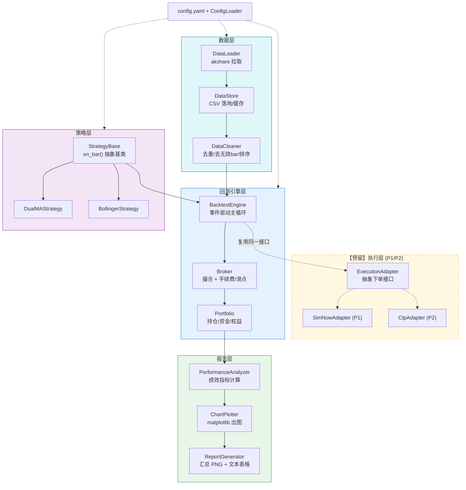
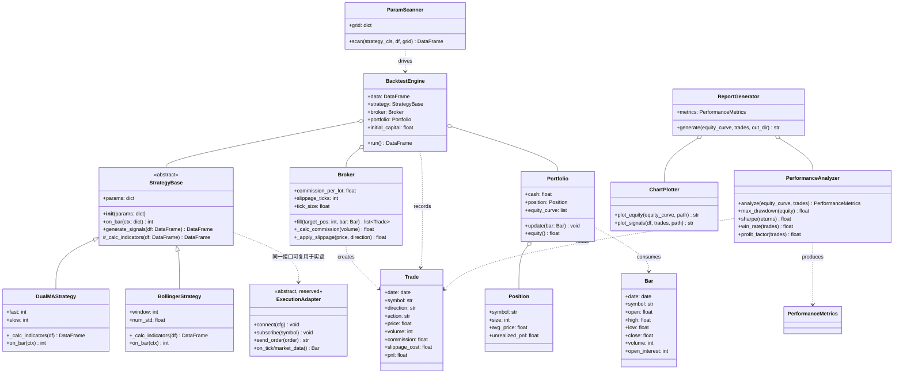
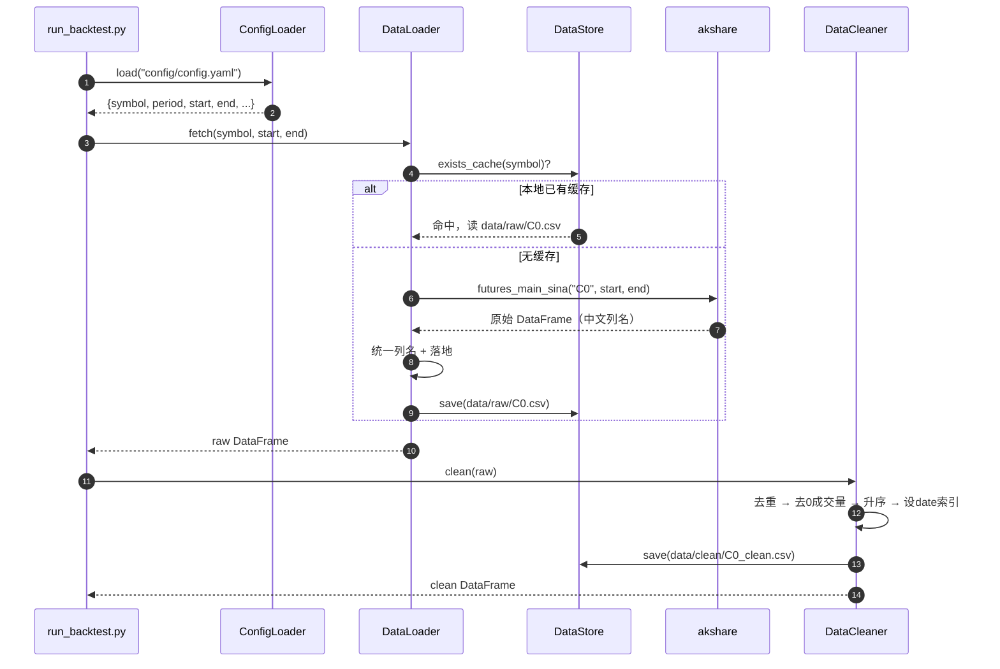
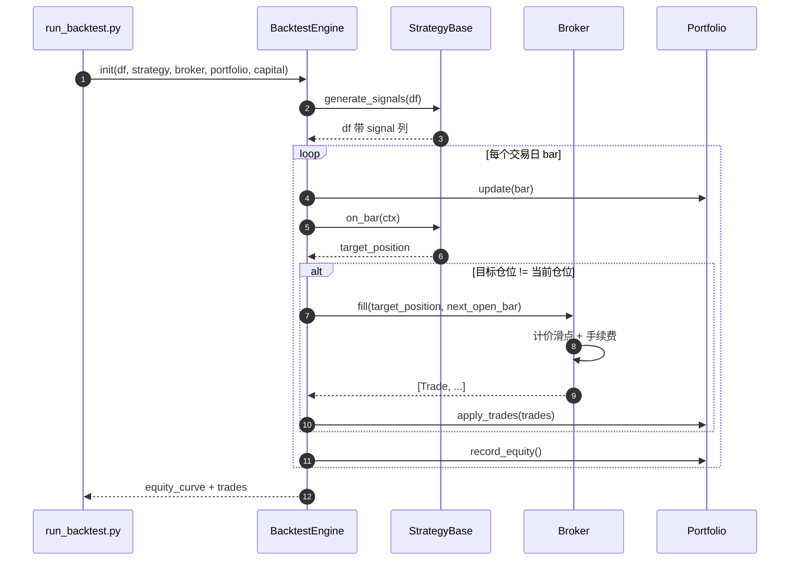
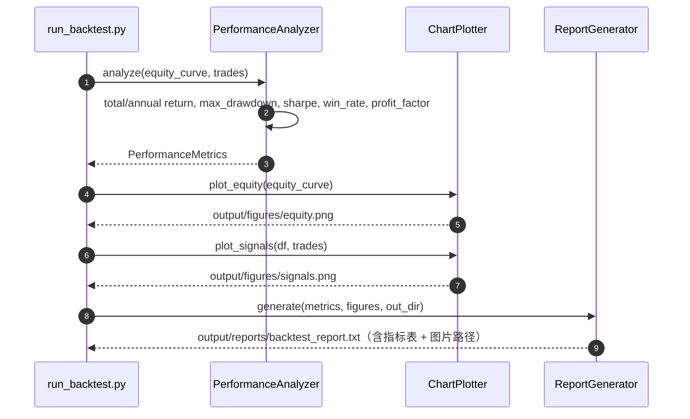
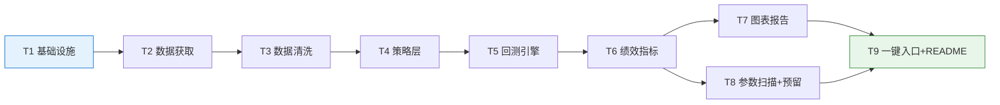

# 03 系统设计与任务分解 —— 个人量化交易 Demo（quant-demo）

> **文档类型**：系统设计 + 任务分解（架构师产出）  
> **项目**：个人量化交易 Demo（quant-demo），项目根目录 `C:/Users/eeyor/WorkBuddy/demo/quant-demo/`  
> **编写日期**：2026-10-08  
> **关联文档**：《01 量化背景与前置需求》《02 PRD》  
> **目标读者**：① 工程师（寇豆码，直接照本文档编码）② 项目所有者（项目主用户，量化新手）  
> **写作原则**：全中文 · 结论先行 · 大白话 + 类比 · 表格对比 · 结构化（Mermaid）  
> **本文档定位**：既是"施工图纸"（工程师照做），也是"作品集级文档"（可展示）

---

## 0. 一页速览（结论先行）

| 决策项    | 结论                                          | 一句话理由                              |
| ------ | ------------------------------------------- | ---------------------------------- |
| 环境与包管理 | **uv + Python 3.12**（你有 3.13 也能用，但推荐锁 3.12） | 你已会 uv；3.12 是量化库 wheel 覆盖最全的"最稳区间" |
| 数据源    | **akshare 为主**，tushare 作备份                  | 免费、无需积分、接口现成；日线足够趋势策略              |
| 本地存储   | **MVP 用 CSV**；P1 升级 SQLite/Parquet          | 近 5 年日线仅约 1200 行，CSV 最简可行、肉眼可查     |
| 回测引擎   | **自研轻量事件驱动**（不引 backtrader/vnpy）            | 代码可控、能讲清楚（作品集叙事）；且天然为 CTP 实盘衔接留好接口 |
| 可视化    | **matplotlib → PNG**                        | 一行依赖、离线出图、报告直接看                    |
| 绩效指标   | **自研**（基于 pandas/numpy）                     | ≥5 个指标公式透明、可写进简历讲原理                |
| 配置管理   | **单个 `config.yaml`（pyyaml）**                | 轻量，改品种/参数/成本不用动代码                  |
| 架构分层   | 数据层 / 策略层 / 回测引擎层 / 报告层 /【预留】执行层            | 五层解耦，策略与实盘复用同一接口                   |
| 任务分解   | **T1 ~ T9**（细粒度）+ 5 大工作包分组                  | 工程师拿着就能写；主理人可按 5 包排期               |

> **一句话总纲**：用 uv 起一个 Python 3.12 项目 → akshare 拉玉米主力连续日线落地 CSV → 清洗 → 抽象 `Strategy` 基类（双均线 / 布林带实现它）→ 自研事件驱动回测引擎（计手续费+滑点）→ 算绩效 → matplotlib 出图 → 参数扫描 → `python run_backtest.py` 一条命令产出报告。

---

## 1. 技术选型与论证

> 每节结构：对比表 → **明确推荐** → 理由。

### 1.1 环境与包管理

| 方案         | 优点                        | 缺点                  | 对本项目     |
| ---------- | ------------------------- | ------------------- | -------- |
| **uv**     | 极快、能装 Python 本体、锁文件精确、你已会 | 相对新                 | ✅ **推荐** |
| venv + pip | 标准库自带、通用                  | 慢、需自己装 Python、依赖解析弱 | 备选       |
| conda      | 科学计算生态成熟                  | 重、体积大、与本机习惯不符       | 不选       |

**Python 版本**（关键，需核实兼容性）：

| Python   | 量化库 wheel 覆盖                           | 结论         |
| -------- | -------------------------------------- | ---------- |
| 3.11     | 好，但 NumPy 2.5(2026-06) 已弃用 3.11        | 不用         |
| **3.12** | **全部重量级库齐全（黄金区间）**                     | ✅ **推荐锁定** |
| 3.13     | 齐全（你本机就是），akshare 官方 classifier 含 3.13 | ✅ 可直接用     |
| 3.14     | 纯 Python 包无碍，带 C 扩展的包 wheel 可能滞后       | 不选         |

**兼容性核查（2026-10 检索）**：

- **akshare**：`requires-python >=3.11`，官方 classifier 声明支持 **3.11–3.14**，当前版本约 **1.18.92**，纯 Python wheel。
- **pandas** ≥2.2 支持 3.12/3.13；**matplotlib** ≥3.8 支持 3.12/3.13；**numpy** 2.5 起支持 3.12–3.14。

> ✅ **结论**：`uv init` + **Python 3.12**。本机已有 3.13 也可直接用（`uv venv --python 3.13`），二者皆可；**为规避个别包对 3.13 的滞后，默认锁 3.12**。

### 1.2 数据源

| 维度     | **akshare**                                                                         | tushare                        |
| ------ | ----------------------------------------------------------------------------------- | ------------------------------ |
| 费用     | **免费、无需积分**                                                                         | 期货日线 `fut_daily` 需 **2000 积分** |
| 期货日线接口 | `futures_main_sina`（主力连续）、`futures_zh_daily_sina`（单合约）、`futures_hist_em`（历史段，>10 年） | `fut_daily`                    |
| 稳定性    | 依赖新浪/东财等公开源，偶有变动                                                                    | 官方数据，稳定但限频（~80 次/分、500 次/天）    |
| 上手难度   | 低                                                                                   | 需注册取 token                     |

**akshare 关键接口与用法**（工程师直接照抄）：

| 用途     | 接口                                                                              | 关键参数               | 返回字段（中文列名需重命名）                              |
| ------ | ------------------------------------------------------------------------------- | ------------------ | ------------------------------------------- |
| 主力连续日线 | `ak.futures_main_sina(symbol="C0", start_date="20200101", end_date="20201016")` | `symbol="C0"` 玉米主连 | 日期/开盘价/最高价/最低价/收盘价/成交量/持仓量/动态结算价            |
| 单合约日线  | `ak.futures_zh_daily_sina(symbol="C2601")`                                      | 具体合约代码             | date/open/high/low/close/volume/hold/settle |
| 任意时段历史 | `ak.futures_hist_em(symbol="玉米", period="daily", start_date, end_date)`         | 中文品种名              | 日期/开盘/收盘/最高/最低/成交量/持仓量 等                    |

**注意事项**：① 接口返回列名不统一，需在 `loader.py` 里 **统一重命名**；② 免费源偶有重复行、0 成交量 bar，交给清洗层处理；③ 接口名可能随版本变动，重命名逻辑集中一处便于维护；④ **主力连续换月会跳空**，MVP 用主连验证逻辑即可（PRD 已接受），P1 再做换月拼接。

> ✅ **结论**：**akshare 为主，tushare 作可选备份**。在 `loader.py` 中设计 `DataSource` 抽象，新增 tushare 只需加一个实现类。

### 1.3 本地存储格式

| 方案      | 优点                | 缺点              | 适配量级                   |
| ------- | ----------------- | --------------- | ---------------------- |
| **CSV** | 零依赖、肉眼可查、Excel 能开 | 无类型、大文件慢        | 日线 1200 行 / 分钟线 ~35 万行 |
| SQLite  | 单文件库、支持增量/查询      | 需要写 SQL、读回略繁    | 分钟线友好                  |
| Parquet | 列存、压缩、读快          | 需 pyarrow、无法肉眼查 | 大数据量                   |

近 5 年日线仅约 **1200 行 × 8 列 ≈ 100KB**，任何格式都无压力。

> ✅ **结论**：**MVP 用 CSV**（满足"数据可离线复用"P0-1）/ 目录 `data/raw/`、`data/clean/`）。**P1 引入分钟线（~35 万行）时升级 SQLite**。存储层用 `store.py` 封装读写，将来换实现不改上层。

### 1.4 回测引擎（重点论证）

| 方案           | 可控性      | 学习/讲解成本    | CTP 衔接       | 依赖                 | 对作品集      |
| ------------ | -------- | ---------- | ------------ | ------------------ | --------- |
| **自研轻量事件驱动** | ⭐⭐⭐⭐⭐    | 中（自己写，讲得清） | ⭐⭐⭐⭐⭐ 接口自己定  | 无（只用 pandas/numpy） | ✅ **最契合** |
| backtrader   | ⭐⭐⭐ 黑盒较深 | 高（框架概念多）   | ⭐⭐ 需自己桥接     | 中                  | 一般（像"调库"） |
| vnpy         | ⭐⭐       | 很高         | ⭐⭐⭐⭐⭐ 原生 CTP | 重                  | 过度（杀鸡用牛刀） |
| vectorbt     | ⭐⭐⭐      | 中          | ⭐ 无实盘        | 中                  | 偏"炫技"     |

**为什么自研**（两条硬理由 + 一条软理由）：

1. **作品集叙事**："回测引擎是我自己写的，bar 如何推进、信号如何转成成交、手续费滑点如何进账，我都能一行行讲清楚"——这比"我调用了 backtrader"更能体现工程能力。
2. **实盘衔接**：自研的 `Strategy.on_bar()` 接口 + 事件驱动主循环，正是 CTP 实盘所需的形态——将来把"历史 bar 数据源"换成"CTP 行情订阅"、把"模拟撮合"换成"CTP 下单"，**策略代码一行不改**。用 backtrader/vnpy 反而要学两套。
3. 依赖最轻（只用 pandas/numpy），符合"预算敏感 + 依赖轻量"。

> ✅ **结论**：**自研轻量事件驱动回测引擎**。核心三要素：**①按 bar 推进的主循环；②策略产生目标仓位；③撮合器按"次根开盘价 + 滑点"成交并计手续费**。

### 1.5 可视化与报告 / 绩效指标

| 方案                   | 优点          | 缺点       | 结论          |
| -------------------- | ----------- | -------- | ----------- |
| **matplotlib → PNG** | 一行依赖、离线出图、稳 | 交互弱      | ✅ **MVP 用** |
| plotly → HTML        | 可交互、好看      | 需浏览器、多依赖 | P2 Web 看板再用 |

**绩效指标**：自研（基于 pandas/numpy），实现 收益曲线 / 最大回撤 / 年化收益 / 夏普 / 胜率 / 盈亏比 / 交易次数。理由：公式透明、可写进简历逐条讲、避免引入第三方绩效库的隐性口径差异。

> ⚠️ **本机注意**：Windows 下 matplotlib 默认字体不含中文，需在绘图初始化时设置 `plt.rcParams['font.sans-serif'] = ['Microsoft YaHei']`（Windows 自带微软雅黑），并 `plt.rcParams['axes.unicode_minus'] = False`。

### 1.6 是否引入配置管理

| 方案                           | 结论                                    |
| ---------------------------- | ------------------------------------- |
| **单个 `config.yaml`（pyyaml）** | ✅ **MVP 用**——品种、周期、参数、手续费、滑点、初始资金集中一处 |
| pyproject `[tool]`           | 备选，但与打包弱相关，不够直观                       |
| Python 字典常量                  | 太散，改参数要动代码                            |

> ✅ **结论**：根目录 `config/config.yaml` + `src/utils/config_loader.py` 统一读取。一个文件搞定"改参数不碰代码"。

---

## 2. 系统架构

### 2.1 分层架构图



**数据流一句话**：`config.yaml` 驱动 → 数据层拉取并缓存 CSV → 清洗 → 引擎按 bar 推进 → 策略出信号 → Broker 撮合成交并扣费 → Portfolio 记录权益 → 报告层算指标出图。**执行层（虚线）是未来把"历史 bar"换成"实时行情"、把"模拟撮合"换成"真实下单"的预留插槽。**

### 2.2 模块职责

| 层     | 模块                         | 职责                                                 |
| ----- | -------------------------- | -------------------------------------------------- |
| 数据层   | `loader`                   | 从 akshare 拉取日线；统一列名；落地 `data/raw/`                 |
|       | `cleaner`                  | 去重、去 0 成交量 bar、按日期升序、设日期索引                         |
|       | `store`                    | CSV 读写 + 缓存命中判断（存在即不联网）                            |
| 策略层   | `base`                     | `StrategyBase` 抽象基类（`on_bar` / `generate_signals`） |
|       | `dual_ma`                  | 双均线金叉死叉策略                                          |
|       | `bollinger`                | 布林带突破策略                                            |
| 引擎层   | `engine`                   | 事件驱动主循环：逐 bar 喂给策略、下单、推进                           |
|       | `broker`                   | 撮合、手续费、滑点、成交回报                                     |
|       | `portfolio`                | 资金、持仓、权益曲线记录                                       |
| 报告层   | `metrics`                  | 绩效指标计算                                             |
|       | `plotter`                  | matplotlib 绘制权益曲线 / 买卖点                            |
|       | `report`                   | 汇总指标 + 图，生成文本报告与文件                                 |
| 预留执行层 | `execution`                | `ExecutionAdapter` 抽象；P1 接 SimNow、P2 接 CTP         |
| 工具    | `config_loader` / `logger` | 读配置、统一日志                                           |

---

## 3. 模块划分与文件列表

> 所有路径**相对项目根目录** `C:/Users/eeyor/WorkBuddy/demo/quant-demo/`。粒度细到工程师可直接 `mkdir` + 建文件。

```
quant-demo/
├── pyproject.toml                 # uv 项目定义 + 依赖声明（P0）
├── config/
│   └── config.yaml                # 品种/周期/参数/成本/资金 集中配置
├── src/
│   ├── __init__.py
│   ├── data/
│   │   ├── __init__.py
│   │   ├── loader.py              # akshare 拉取 + 统一列名
│   │   ├── cleaner.py             # 去重/去无效bar/排序/索引
│   │   └── store.py               # CSV 落地 + 缓存命中
│   ├── strategy/
│   │   ├── __init__.py
│   │   ├── base.py                # StrategyBase 抽象基类
│   │   ├── dual_ma.py             # 双均线策略
│   │   └── bollinger.py           # 布林带策略
│   ├── engine/
│   │   ├── __init__.py
│   │   ├── engine.py              # 事件驱动回测主循环
│   │   ├── broker.py              # 撮合 + 手续费 + 滑点
│   │   └── portfolio.py           # 资金/持仓/权益
│   ├── report/
│   │   ├── __init__.py
│   │   ├── metrics.py             # 绩效指标
│   │   ├── plotter.py             # matplotlib 出图
│   │   └── report.py              # 报告汇总
│   ├── execution/                 # 【预留】P1/P2 实盘适配层
│   │   ├── __init__.py
│   │   └── base.py                # ExecutionAdapter 抽象接口（MVP 只留接口）
│   └── utils/
│       ├── __init__.py
│       ├── config_loader.py       # 读 config.yaml
│       └── logger.py              # 日志初始化
├── run_backtest.py                # ★ 一键入口（P0-7）
├── scripts/
│   └── run_param_scan.py          # 参数扫描入口（P0-6）
├── tests/
│   ├── __init__.py
│   ├── test_cleaner.py            # 清洗逻辑单测
│   ├── test_engine.py             # 引擎撮合/费用单测
│   └── test_metrics.py            # 指标公式单测
├── data/
│   ├── raw/                       # 原始 CSV 缓存（gitignore）
│   └── clean/                     # 清洗后 CSV（gitignore）
├── output/                        # 报告与 PNG（gitignore）
│   ├── figures/
│   └── reports/
├── README.md                      # 新手上手文档（P0-8）
└── .gitignore
```

**文件清单表**（工程师逐个创建）：

| #  | 文件（相对路径）                     | 职责                         | 归属任务  |
| -- | ---------------------------- | -------------------------- | ----- |
| 1  | `pyproject.toml`             | uv 项目 + 依赖                 | T1    |
| 2  | `.gitignore`                 | 忽略 data/output/`__pycache__` | T1    |
| 3  | `config/config.yaml`         | 全部可调参数                     | T1    |
| 4  | `src/utils/config_loader.py` | 读 YAML 返回 dict/对象          | T1    |
| 5  | `src/utils/logger.py`        | 统一日志格式                     | T1    |
| 6  | `src/data/loader.py`         | akshare 拉取 + 列名统一          | T2    |
| 7  | `src/data/store.py`          | CSV 读写 + 缓存                | T2    |
| 8  | `src/data/cleaner.py`        | 清洗管道                       | T3    |
| 9  | `src/strategy/base.py`       | 策略抽象基类                     | T4    |
| 10 | `src/strategy/dual_ma.py`    | 双均线                        | T4    |
| 11 | `src/strategy/bollinger.py`  | 布林带                        | T4    |
| 12 | `src/engine/portfolio.py`    | 资金/持仓                      | T5    |
| 13 | `src/engine/broker.py`       | 撮合/费用/滑点                   | T5    |
| 14 | `src/engine/engine.py`       | 事件驱动主循环                    | T5    |
| 15 | `src/report/metrics.py`      | 绩效指标                       | T6    |
| 16 | `src/report/plotter.py`      | matplotlib 出图              | T7    |
| 17 | `src/report/report.py`       | 报告汇总                       | T7    |
| 18 | `src/execution/base.py`      | 实盘适配抽象（预留）                 | T8    |
| 19 | `scripts/run_param_scan.py`  | 参数扫描                       | T8    |
| 20 | `run_backtest.py`            | 一键入口                       | T9    |
| 21 | `README.md`                  | 上手文档                       | T9    |
| 22 | `tests/*.py`                 | 关键单测                       | 各任务随附 |

---

## 4. 数据模型

> 用 **Python `dataclass`** 表达（既做文档也做代码骨架）。

### 4.1 K 线（Bar）

| 字段              | 类型              | 单位  | 说明                       |
| --------------- | --------------- | --- | ------------------------ |
| `date`          | `datetime.date` | —   | 交易日（主键、升序、唯一）            |
| `symbol`        | `str`           | —   | 合约代码，如 `C2601` / 主连 `C0` |
| `open`          | `float`         | 元/吨 | 开盘价                      |
| `high`          | `float`         | 元/吨 | 最高价                      |
| `low`           | `float`         | 元/吨 | 最低价                      |
| `close`         | `float`         | 元/吨 | 收盘价                      |
| `volume`        | `int`           | 手   | 成交量                      |
| `open_interest` | `int`           | 手   | 持仓量（akshare 的"持仓量/hold"） |


```python
@dataclass
class Bar:
    date: datetime.date
    symbol: str
    open: float
    high: float
    low: float
    close: float
    volume: int
    open_interest: int
```

> 落地 CSV 列名统一为：`date,symbol,open,high,low,close,volume,open_interest`（小写下划线）。

### 4.2 成交记录（Trade）

| 字段              | 类型              | 说明                    |
| --------------- | --------------- | --------------------- |
| `date`          | `datetime.date` | 成交日                   |
| `symbol`        | `str`           | 合约                    |
| `direction`     | `str`           | `LONG` / `SHORT`（多/空） |
| `action`        | `str`           | `OPEN` / `CLOSE`      |
| `price`         | `float`         | 成交价（已含滑点）             |
| `volume`        | `int`           | 手数                    |
| `commission`    | `float`         | 本笔手续费（元）              |
| `slippage_cost` | `float`         | 本笔滑点成本（元）             |
| `pnl`           | `float`         | 平仓时的已实现盈亏（元；开仓为 0）    |

### 4.3 持仓（Position）

| 字段               | 类型      | 说明                       |
| ---------------- | ------- | ------------------------ |
| `symbol`         | `str`   | 合约                       |
| `size`           | `int`   | 持仓手数（**正数=多、负数=空**，0=空仓） |
| `avg_price`      | `float` | 持仓均价                     |
| `unrealized_pnl` | `float` | 浮动盈亏（元）                  |

### 4.4 绩效指标（PerformanceMetrics）

| 字段                 | 类型      | 定义                           |
| ------------------ | ------- | ---------------------------- |
| `total_return`     | `float` | 累计收益率 =（期末权益/期初 − 1）         |
| `annual_return`    | `float` | 年化收益 =（1+总收益)^(252/交易日数) − 1 |
| `max_drawdown`     | `float` | 最大回撤（权益曲线峰值到谷底的最大跌幅）         |
| `sharpe`           | `float` | 夏普 = 日均收益/日收益波动 × √252       |
| `win_rate`         | `float` | 胜率 = 盈利平仓次数 / 总平仓次数          |
| `profit_factor`    | `float` | 盈亏比 = 总盈利额 / 总亏损额            |
| `trade_count`      | `int`   | 交易（平仓）次数                     |
| `total_commission` | `float` | 累计手续费                        |
| `total_slippage`   | `float` | 累计滑点成本                       |

> 报告须**明确打印** `total_commission` 与 `total_slippage`，以证明 P0-4 / 验收 A7"成本已计入"。

---

## 5. 策略接口设计（类图）

### 5.1 类图



### 5.2 策略基类设计（实盘复用的关键）

`StrategyBase` 只暴露**一件事**：给定"当前及历史 bar"，返回**目标仓位**。

```python
class StrategyBase(ABC):
    def __init__(self, params: dict): ...
    @abstractmethod
    def generate_signals(self, df: pd.DataFrame) -> pd.DataFrame:
        """输入清洗后的日线 DataFrame，返回新增 signal 列（1 多 / -1 空 / 0 平）。"""

    def on_bar(self, ctx: dict) -> int:
        """回测/实盘统一入口：返回目标仓位（手数，正多负空）。"""
```

- **双均线（DualMAStrategy）**：`_calc_indicators` 算 `MA_fast`、`MA_slow`；`MA_fast > MA_slow` → 信号 `+1`（做多），`<` → `-1`（做空）。
- **布林带（BollingerStrategy）**：算中轨 `MA`、上/下轨 `MA ± num_std×STD`；收盘突破上轨 → `+1`，跌破下轨 → `-1`。
- **实盘复用**：回测里 `on_bar` 的输入来自历史 DataFrame；实盘里 `ExecutionAdapter` 把 CTP 实时行情组装成同样的 `ctx` 调 `on_bar`——**策略代码完全不变**。这就是"回测→仿真→实盘"共用一套策略的地基。

---

## 6. 关键流程时序图

### 6.1 数据获取 → 入库 → 清洗



### 6.2 回测运行（bar 推进 → 信号 → 撮合 → 记录）



> **成交价约定**：信号在 **T 日收盘产生**，成交在 **T+1 日开盘价 ± 滑点**执行（避免"用当日收盘价成交"的未来函数陷阱）。此为**共享知识**，全项目统一。

### 6.3 绩效报告生成



---

## 7. 任务分解（核心）

> **阅读方式**：每个任务 = 目标 / 涉及文件 / 前置依赖 / 验收点。**T1~T9 细到"拿着任务列表即可写代码"，且每个任务都能独立验证。**
>
> **与 5 大工作包的映射**（主理人排期用）：T1→工作包①基础设施；T2+T3→工作包②数据管道；T4+T5→工作包③策略与引擎；T6+T7→工作包④绩效与报告；T8+T9→工作包⑤扫描与交付。

### T1 项目基础设施（脚手架）

- **目标**：建好 uv 项目、依赖、配置、日志、目录骨架，`python run_backtest.py` 能打印"环境就绪"。
- **涉及文件**：`pyproject.toml`、`.gitignore`、`config/config.yaml`、`src/utils/config_loader.py`、`src/utils/logger.py`、各 `__init__.py`、空的 `run_backtest.py` 骨架。
- **前置依赖**：无。
- **验收点**：① `uv sync` 成功装好全部依赖；② `uv run python -c "from src.utils.config_loader import load_config; print(load_config())"` 能打印配置；③ 目录结构与列表一致。

### T2 数据获取模块（P0-1）

- **目标**：从 akshare 拉玉米主力连续日线，统一列名，落地 `data/raw/`；二次运行命中缓存不联网。
- **涉及文件**：`src/data/loader.py`、`src/data/store.py`。
- **前置依赖**：T1。
- **验收点**：① 首次运行生成 `data/raw/C0.csv`（约 1200 行）；② 打印列名 = `date,symbol,open,high,low,close,volume,open_interest`；③ 断网/二次运行直接从缓存读取。

### T3 数据清洗模块（P0-2）

- **目标**：去重、去 0 成交量 bar、升序、设日期索引，输出 `data/clean/C0_clean.csv`。
- **涉及文件**：`src/data/cleaner.py`、`tests/test_cleaner.py`。
- **前置依赖**：T2。
- **验收点**：① 清洗后无重复日期、无 volume=0 行；② 索引为升序 DatetimeIndex/date；③ 单测通过。

### T4 策略层（P0-3）

- **目标**：抽象 `StrategyBase`，实现双均线与布林带，均返回 signal 序列。
- **涉及文件**：`src/strategy/base.py`、`src/strategy/dual_ma.py`、`src/strategy/bollinger.py`。
- **前置依赖**：T3。
- **验收点**：① 两个策略对同一 df 能算出 signal 列且值 ∈ {-1,0,1}；② 参数从 config 注入；③ 随机抽查金叉/死叉位置与手工计算一致。

### T5 回测引擎（P0-4）

- **目标**：事件驱动主循环 + 撮合 + 手续费/滑点 + 资金持仓，产出权益曲线与成交记录。
- **涉及文件**：`src/engine/engine.py`、`src/engine/broker.py`、`src/engine/portfolio.py`、`tests/test_engine.py`。
- **前置依赖**：T4。
- **验收点**：① 单笔手工可核对的交易，扣除手续费与滑点后盈亏与手算一致；② 支持多空；③ 输出 `equity_curve` 与 `trades` 结构符合第 4 章定义；④ 单测通过。

### T6 绩效指标模块（P0-5 指标部分）

- **目标**：实现 5+ 指标（收益曲线/最大回撤/夏普/胜率/盈亏比）+ 年化收益 + 交易次数 + 成本合计。
- **涉及文件**：`src/report/metrics.py`、`tests/test_metrics.py`。
- **前置依赖**：T5。
- **验收点**：① 对构造的已知序列，`max_drawdown`、`sharpe`、`win_rate` 与手算一致；② 报告能打印 `total_commission`、`total_slippage`；③ 单测通过。

### T7 图表与报告模块（P0-5 图表部分）

- **目标**：matplotlib 出权益曲线图 + 买卖点标注图（PNG），生成文本报告。
- **涉及文件**：`src/report/plotter.py`、`src/report/report.py`。
- **前置依赖**：T6。
- **验收点**：① `output/figures/` 生成 `equity.png`、`signals.png`（中文不乱码）；② `output/reports/` 生成含指标表与图路径的报告文本；③ 图上有买卖点标记。

### T8 参数扫描 + 实盘适配预留（P0-6 / 预留 P1-P2）

- **目标**：参数网格扫描输出"参数-绩效对比表"；建立 `ExecutionAdapter` 抽象接口（MVP 只留接口不实现）。
- **涉及文件**：`scripts/run_param_scan.py`、`src/execution/base.py`。
- **前置依赖**：T6。
- **验收点**：① 双均线快/慢参数网格（≥3 组）跑出对比表（CSV + 控制台）；② `ExecutionAdapter` 定义 `connect/subscribe/send_order` 抽象方法且可被 import；③ 文档说明未来如何接入。

### T9 一键入口 + README（P0-7 / P0-8）

- **目标**：`run_backtest.py` 一条命令跑通全流程；README 面向新手可照做。
- **涉及文件**：`run_backtest.py`、`README.md`、`config/config.yaml`（最终用例默认值）。
- **前置依赖**：T7、T8。
- **验收点**：① `uv run python run_backtest.py` 无人工干预产出报告，全程 ≤5 分钟；② README 含环境搭建、运行命令、目录说明；③ 新手按 README ≤1 小时出第一份报告。


**任务依赖图**：



---

## 8. 依赖包清单

> 全部走 `uv add`，`pyproject.toml` 统一声明。版本为撰写时（2026-10）建议值；**不确定处标"以安装时为准"**。

| 包            | 建议版本           | 用途            | 备注                          |
| ------------ | -------------- | ------------- | --------------------------- |
| `python`     | `>=3.12,<3.14` | 运行时           | 3.12 最稳，3.13 可用             |
| `akshare`    | `>=1.18.92`    | 期货日线数据        | 支持 3.11–3.14；纯 Python wheel |
| `pandas`     | `>=2.2,<3`     | 数据处理          | 3.12/3.13 wheel 齐全          |
| `numpy`      | `>=1.26`       | 数值计算          | 2.x 支持 3.12–3.14            |
| `matplotlib` | `>=3.8`        | 出图 PNG        | 需设中文字体                      |
| `pyyaml`     | `>=6.0`        | 读 config.yaml | 纯 Python                    |
| `tqdm`       | `>=4.66`       | 进度条（参数扫描）     | 可选，akshare 已带               |
| `tushare`    | 以安装时为准         | 数据备份源（可选）     | 期货日线需 2000 积分               |
| `pytest`     | `>=8`          | 单元测试（dev）     | `[dependency-groups] dev`   |

> 依赖轻量：MVP 运行时仅 **akshare + pandas + numpy + matplotlib + pyyaml** 5 个直接依赖。

---

## 9. 共享知识（跨文件约定）

> 工程师写代码前**必读**，全项目统一，避免各写各的。

| 项                 | 约定                                                                                                        |
| ----------------- | --------------------------------------------------------------------------------------------------------- |
| **合约代码格式**        | 具体合约用 `字母+年月`（如 `C2601` = 玉米 2026 年 1 月）；**主力连续**统一用 `字母+0`（akshare 惯例，如玉米 `C0`）。config 里 `symbol: "C0"`。 |
| **主力连续处理**        | MVP 直接用主连（存在换月跳空，已在 PRD 接受）；P1 再做换月价差拼接，逻辑集中在 `loader.py`。                                                |
| **时间戳格式**         | 日线用 `datetime.date`（`YYYY-MM-DD`）；CSV 存储也用 `YYYY-MM-DD`；禁止混用字符串。                                          |
| **价格精度 / 最小变动价位** | 每个品种有 `tick_size`（玉米 C = 1 元/吨，放 config）；滑点 = `slippage_ticks × tick_size`（默认 1 跳）。                       |
| **单位**            | 数量单位 = **手**；金额单位 = **元**；收益率/回撤 = 小数（如 0.15 = 15%）。                                                      |
| **成交价约定**         | 信号在 T 日收盘产生，**T+1 日开盘价 ± 滑点**成交（防未来函数）。                                                                   |
| **手续费**           | 早课按**手数**计（`commission_per_lot`，元/手），放 config，按品种设置；后续支持按成交额比例。                                           |
| **配置读取**          | 一律经 `src/utils/config_loader.py`，禁止散落硬编码常量。                                                               |
| **日志规范**          | 用 `logging`，格式 `%(asctime)s [%(levelname)s] %(name)s: %(message)s`；INFO 记流程节点，DEBUG 记逐笔明细。                |
| **目录约定**          | 原始数据 `data/raw/`，清洗数据 `data/clean/`，产物 `output/figures/`、`output/reports/`；三者均在 `.gitignore`。             |
| **随机性**           | MVP 无随机；如后续引入需固定 `seed`。                                                                                  |
| **编码**            | 全项目 UTF-8；matplotlib 设 `font.sans-serif=['Microsoft YaHei']`。                                             |

---

## 10. 真实落地路线

### 10.1 环境搭建（面向新手，一步步带命令）

> 在 **Windows PowerShell** 中操作；`cd` 进项目根目录。

```powershell
# ① 安装 uv（若已装可跳过）
powershell -ExecutionPolicy ByPass -c "irm https://astral.sh/uv/install.ps1 | iex"

# ② 进项目目录
cd C:\Users\eeyor\WorkBuddy\demo\quant-demo

# ③ 用 uv 初始化项目并锁定 Python 3.12
uv init
uv python install 3.12
uv venv --python 3.12
.\.venv\Scripts\Activate.ps1        # 激活虚拟环境（若报执行策略错误见下方提示）

# ④ 安装依赖
uv add akshare pandas numpy matplotlib pyyaml
uv add --dev pytest

# ⑤ 验证
uv run python -c "import akshare,pandas,numpy,matplotlib; print('依赖 OK')"
```

**预期输出**：`依赖 OK`。  
**常见坑**：若 `Activate.ps1` 被拦截，执行 `Set-ExecutionPolicy -Scope CurrentUser RemoteSigned` 后重试；或用 `uv run <命令>` 免激活。

### 10.2 跑通第一个回测（预期输出示例）

```powershell
uv run python run_backtest.py
```

**预期输出（示意）**：

```
[INFO] 加载配置 config/config.yaml
[INFO] 数据缓存命中: data/clean/C0_clean.csv (1203 行)
[INFO] 策略: DualMA(fast=5, slow=20) | 初始资金: 100000.0 元
[INFO] 回测完成，共 18 笔交易
=================== 绩效报告 ===================
  累计收益率 :  12.35%
  年化收益率 :   2.34%
  最大回撤   :  -8.72%
  夏普比率   :   0.41
  胜率       :  55.56%
  盈亏比     :   1.32
  交易次数   :  18
  累计手续费 :  216.00 元
  累计滑点   :  180.00 元
================================================
[INFO] 权益曲线图: output/figures/equity.png
[INFO] 买卖点图  : output/figures/signals.png
[INFO] 报告已生成: output/reports/backtest_report.txt
```

**交付判据**：`output/` 下有 2 张 PNG + 1 份文本报告，指标 ≥5 项，成本可见（验收 A2~A7）。

### 10.3 【P1 预留】SimNow 接入要点

> 本阶段**只留接口不实现**，以下为将来接入要点（引自文档 01 第 3 章）。

- **连接参数**：BrokerID、InvestorID（账号）、Password、行情前置地址（MD Front）、交易前置地址（TD Front）。
- **双环境**：SimNow 有 **"看穿式"环境**（模拟真实开户，更规范）与 **"7×24"环境**（全天可测）——账号与前置地址不同，**务必记录区分**，连错连不上。
- **已知限制**：仿真环境**不支持市价单**等部分委托类型，用限价单。
- **接入方式**：实现 `ExecutionAdapter`——`connect()` 连 CTP、`subscribe()` 订行情、`send_order()` 下单；行情组装成 `Bar` 喂给同一个 `StrategyBase.on_bar()`。
- **技术路径**：Python 侧可用 `openctp-ctp` / `vnpy` 的 CTP 封装，届时再定，**不影响 MVP 架构**。

### 10.4 【P2 预留】实盘前置清单

> 引自文档 01 **第 4 章**，实盘前**必须**完成，否则违规。

1. **开立期货账户**：线上 15~30 分钟，普通商品期货无资金门槛。
2. **程序化交易报备（红线）**：客户→期货公司报告 → 期货公司核查后报交易所 → 交易所反馈 → **期货公司向客户确认** → **收到确认后方可实盘**。
3. **报备内容**：账户基本信息、交易与软件信息（软件名称/功能/开发主体）、交易所要求的其他信息；若涉高频需额外报告策略、报撤单频率等。
4. **系统接入要求**：技术系统接入前须经期货公司测试；**不得绕过期货公司直连交易所**。
5. **资金量级**：先以低保证金品种（玉米/甲醇）小资金 3000~5000 元试水。
6. **红线清单**：未报备不实盘 / 不直连交易所 / 未经测试不上生产 / 不隐瞒高频 / 不碰零售外汇 / 不代客理财。

---

## 11. 待明确事项

| #  | 事项               | 现状/假设                                      | 需谁拍板      |
| -- | ---------------- | ------------------------------------------ | --------- |
| U1 | 手续费具体取值          | 假设玉米按 **~1.2 元/手** 放 config，需按实际开户期货公司费率校准 | 用户（开户后确认） |
| U2 | 滑点档位             | 假设 **1 跳**（玉米 1 元/吨），可调                    | 用户        |
| U3 | 初始资金             | 假设 **10 万元** 演示                            | 用户        |
| U4 | 交易手数/仓位规则        | MVP 假设**固定 1 手**，不做资金管理（风控属 P2）            | 用户/工程师    |
| U5 | 目标 Python 版本     | 建议 3.12；用户本机 3.13，若坚持 3.13 需装依赖时留意个别包      | 用户        |
| U6 | 报告语言/格式          | MVP 文本 + PNG；是否要 XLSX 对比表                  | 用户        |
| U7 | tushare 是否启用     | MVP 不启用，仅预留接口                              | 用户        |
| U8 | 每周投入时长（文档 01 Q8） | 未确认，影响里程碑排期                                | 用户        |

---

> 本文档为《03 系统设计与任务分解》，配套图见 `docs/class-diagram.mermaid` 与 `docs/sequence-diagram.mermaid`。  
> 上游：《01-量化背景与前置需求》《02-PRD》。下游：由工程师（寇豆码）按第 7 章任务列表实现。
