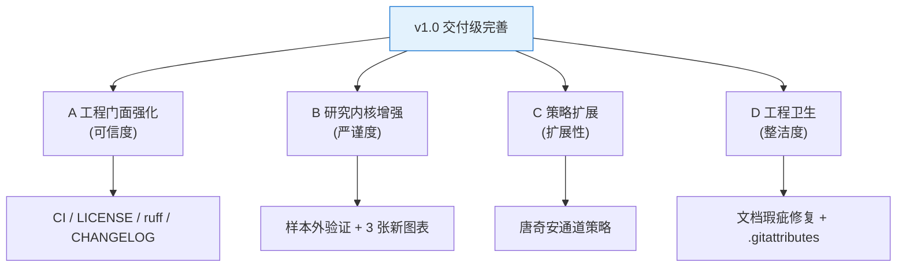

# 04 增量 PRD —— v1.0「交付级完善」

> **文档类型**：简单增量 PRD（仅描述本轮变更，不重复 MVP 既有内容）
> **项目名称**：quant_demo
> **基准版本**：MVP 已上线（T1~T9 全部实现，单测 6/6 通过，玉米 C0 近 5 年 1211 根日线回测跑通）
> **仓库**：https://github.com/Eeyore104/quant-demo （public / main）
> **目标版本**：v1.0「可交付项目」
> **编写日期**：2026-10-08
> **关联文档**：`01-量化背景与前置需求`｜`02-PRD`｜`03-系统设计与任务分解`
> **写作原则**：全中文 · 结论先行 · 表格化 · 只写增量 · 篇幅精炼

---

## 0. 一页速览（结论先行）

| 问题 | 一句话答案 |
|---|---|
| 这轮做什么？ | 把 MVP 提升为**「可交付项目 v1.0」**，服务 ①求职/作品集 ②未来个人研究 |
| 分几块？ | **A 工程门面**（CI/许可证/规范/CHANGELOG）+ **B 研究内核**（样本外验证/图表升级）+ **C 策略扩展**（新增 1 个策略）+ **D 工程卫生**（文档瑕疵/.gitattributes） |
| 有没有新增"大功能"？ | 没有。本轮是**打磨与增强**，不动 MVP 已跑通的主链路 |
| 英文 README 做吗？ | **本轮不做**（用户已拍板） |
| 交付判据 | CI 徽章 push 后显示 passing；样本外验证输出训练/测试对比表；新策略可被参数扫描选中；4 类文档瑕疵修复；CRLF 警告消失 |
| 风险最高的是哪项？ | 样本外验证（B）——需改动回测调用链，须保证不影响既有 6 个单测 |

---

## 1. 增量目标与成功标准

### 1.1 增量目标（对齐三个诉求）

| # | 目标 | 直击诉求 | 说明 |
|---|---|---|---|
| G1 | **门面可信** | 求职/作品集 | 评审者第一眼能看到 CI 绿标、许可证、规范化的代码 |
| G2 | **研究严谨** | 求职/研究 | 用样本外验证证明"不只会跑回测，还懂防过拟合" |
| G3 | **框架可扩展** | 求职/研究 | 用"新增策略 = 新增一个文件"证明架构设计能力 |
| G4 | **仓库整洁** | 交付质量 | 文档无瑕疵、行尾统一、无 CRLF 噪音 |

### 1.2 成功标准（可验证）

| # | 成功标准 | 验证方式 |
|---|---|---|
| S1 | CI 自动跑测试 | push 后 GitHub Actions 自动执行 `pytest`，README 徽章显示 **passing** |
| S2 | 许可证就位 | 仓库根目录存在 `LICENSE`（MIT，版权署名 Eeyore104），GitHub 侧栏识别为 MIT |
| S3 | 代码规范可执行 | 一条命令跑通 `ruff check` 与 `ruff format`，配置写入 `pyproject.toml` |
| S4 | 变更可追溯 | 存在 `CHANGELOG.md`，含本轮 `1.0.0` 条目 |
| S5 | 过拟合有防线 | 样本外验证输出**训练段 / 测试段对比表** |
| S6 | 图表更专业 | 新增回撤区间图、月度收益热力图、参数扫描热力图 |
| S7 | 扩展性被证明 | 新增唐奇安通道策略，**能用配置文件切换**并被参数扫描选中 |
| S8 | 文档零瑕疵 | 文档 4 类瑕疵全部修复（见 V1-8） |
| S9 | 行尾统一 | 新增 `.gitattributes`；`git status` 不再出现 CRLF 警告 |

---

## 2. 范围总览与不做清单

### 2.1 范围总览

### 2.2 本轮不做清单

| # | 不做 | 原因 |
|---|---|---|
| 1 | 英文 README / i18n | 用户已明确本轮不做 |
| 2 | SimNow / CTP 实盘对接 | 属 M6–M9 范畴，非本轮 |
| 3 | Web 看板 | 属 P2 范畴 |
| 4 | 数据库化（SQLite 等） | 属 P1，本轮不需要 |
| 5 | 新增超过 1 个策略 | 本轮只需证明"扩展性"，1 个即可 |
| 6 | 修改 docs/01~03 的格式化改动 | 该批未提交改动已决定**保留**，本轮仅修复 D 项瑕疵 |
| 7 | 重构 MVP 主链路 | 主链路已跑通，本轮只做增量 |

---

## 3. 需求条目（V1-1 起）

> 优先级：**P0 = 本轮必做**；**P1 = 应做**。全部条目均为本轮范围。

### A. 工程门面强化

#### V1-1 GitHub Actions CI（P0）

| 项 | 内容 |
|---|---|
| **需求说明** | 新增 CI 工作流，push / PR 时自动安装依赖并运行 `pytest`；README 顶部增加 CI 状态徽章 |
| **验收要点** | ① `.github/workflows/ci.yml` 存在；② push 后 Actions 自动触发；③ 徽章显示 **passing**；④ 6/6 单测在 CI 中通过；⑤ 失败时徽章变红 |
| **备注** | 徽章 URL 指向本仓库 CI；依赖安装建议走 `uv sync`（与本地一致） |

#### V1-2 MIT LICENSE（P0）

| 项 | 内容 |
|---|---|
| **需求说明** | 仓库根目录新增 MIT 许可证，版权署名默认 **Eeyore104** |
| **验收要点** | ① `LICENSE` 文件存在；② GitHub 仓库页侧栏识别为 **MIT License**；③ 年份与署名正确 |
| **备注** | README 可顺带加一行"License: MIT"链接 |

#### V1-3 ruff 代码规范（P0）

| 项 | 内容 |
|---|---|
| **需求说明** | 引入 ruff 作为 lint + format 工具，配置写入 `pyproject.toml`；对既有代码做一次格式化 |
| **验收要点** | ① `pyproject.toml` 含 `[tool.ruff]` 配置；② `uv run ruff check .` 无错误；③ `uv run ruff format --check .` 通过；④ CI 中可选加入 ruff 检查 |
| **备注** | 格式化后**必须重跑 pytest**，确保 6/6 仍通过 |

#### V1-4 CHANGELOG.md（P1）

| 项 | 内容 |
|---|---|
| **需求说明** | 新增 `CHANGELOG.md`，遵循 Keep a Changelog 风格；本轮初始化版本号 |
| **验收要点** | ① 文件存在；② 含 `[Unreleased]` 段与 `[1.0.0]` 段（本轮）；③ 建议回溯补 `[0.1.0]`（MVP 阶段）；④ 条目按 Added / Changed / Fixed 分类 |
| **版本建议** | MVP = `0.1.0`（当前 `pyproject.toml` 为 0.1.0）→ 本轮升级为 **`1.0.0`**，并同步更新 `pyproject.toml` 的 version 字段 |

### B. 研究内核增强

#### V1-5 样本外验证（P0）

| 项 | 内容 |
|---|---|
| **需求说明** | 在回测流程中加入训练段 / 测试段（样本内 / 样本外）分段验证，识别过拟合：参数在训练段择优，在测试段检验 |
| **验收要点** | ① 可配置分段比例或起止日期；② 输出**训练段 / 测试段对比表**（至少含收益、最大回撤、夏普）；③ 报告明确标注哪段是样本内、哪段是样本外；④ 不影响既有 6 个单测；⑤ 新增至少 1 个相关单测 |
| **备注** | 这是本轮对回测调用链的**唯一实质改动**，需重点回归测试 |

#### V1-6 图表升级（P0）

| 项 | 内容 |
|---|---|
| **需求说明** | 在现有权益曲线图 / 买卖点图基础上，新增 3 张图 |
| **验收要点** | ① **回撤区间图**：标注最大回撤区间；② **月度收益热力图**：按年 × 月排列；③ **参数扫描热力图**：参数网格的绩效色阶图；④ 全部输出到 `output/` 且中文正常显示（复用现有字体设置） |
| **备注** | 复用 `src/report/plotter.py` 的字体与配色，保持风格统一 |

### C. 策略扩展

#### V1-7 新增唐奇安通道策略（P0）

| 项 | 内容 |
|---|---|
| **需求说明** | 新增 1 个经典趋势策略（唐奇安通道 / 海龟突破风格），证明"新增策略 = 新增一个文件"的框架扩展性 |
| **验收要点** | ① 新增策略文件实现统一策略接口；② 通过 `config/config.yaml` 的 `strategy.name` 即可切换；③ 可被参数扫描选中并输出对比；④ 新增对应单测；⑤ **不改动**既有策略与引擎代码 |
| **备注** | 参数建议：通道周期（如 20），突破方向（双向） |

### D. 工程卫生

#### V1-8 文档格式化残留瑕疵修复（P0）

| 项 | 内容 |
|---|---|
| **需求说明** | 修复 `docs/01`、`docs/03` 中的 4 类格式化残留瑕疵（**仅修复下列瑕疵，不改动其他格式化内容**） |
| **验收要点** | 见下表，逐项核对 |

| # | 文件 · 位置 | 现状（错误） | 应改为 |
|---|---|---|---|
| D-1 | `docs/01` 第 76 行 | `&#x662F;` | `是` |
| D-2 | `docs/01` 第 226 行 | `2000~~2400` | `2000~2400` |
| D-3 | `docs/01` 第 226 行 | `3400~~4100` | `3400~4100` |
| D-4 | `docs/01` 第 235 行 | `2155~~2250` | `2155~2250` |
| D-5 | `docs/01` 第 235 行 | `2000~~2376` | `2000~2376` |
| D-6 | `docs/03` 表格 | `**pycache**` | `` `__pycache__` ``（反引号包裹） |

> 说明：D-2~D-5 共 4 处 `~~` 均为**两个波浪线**，应改为**单个** `~`。修复后文档中不应再出现 `~~`（波浪线）与 `&#x`（HTML 实体残留）。

#### V1-9 .gitattributes 与行尾统一（P0）

| 项 | 内容 |
|---|---|
| **需求说明** | 新增 `.gitattributes` 统一行尾，消除 CRLF 警告；执行 `git add --renormalize .` 使存量文件行尾归一 |
| **验收要点** | ① `.gitattributes` 存在，至少含 `* text=auto eol=lf`；② 执行 renormalize 后 `git status` 不再提示 CRLF 警告；③ 归一化后重跑 pytest 仍 6/6 通过 |
| **备注** | 建议对二进制文件（如 `*.png`）显式声明 `binary`，避免被误处理 |

---

## 4. 对既有交付物的影响清单

| 既有交付物 | 受影响的点 | 处理方式 |
|---|---|---|
| **README.md** | ① 顶部新增 **CI 状态徽章**（V1-1）；② 新增 **License** 说明（V1-2）；③ 功能特性补充样本外验证与 3 张新图（V1-5/V1-6）；④ 策略列表新增唐奇安通道（V1-7）；⑤ Roadmap 勾选本轮进度；⑥ 项目文档表新增 `docs/04` | 由工程师更新 |
| **CHANGELOG.md** | 新建；初始化 `[1.0.0]`（本轮）+ 建议补 `[0.1.0]`（MVP） | 新建（V1-4） |
| **pyproject.toml** | ① version `0.1.0` → `1.0.0`；② 新增 `[tool.ruff]` 配置 | 更新（V1-3/V1-4） |
| **tests/** | 测试面扩大：新增/补充样本外验证、新策略相关用例 | 新增用例（V1-5/V1-7） |
| **src/report/** | 新增 3 张图表函数 | 扩展（V1-6） |
| **src/strategy/** | 新增 1 个策略文件 | 扩展（V1-7） |
| **docs/01** | 修复 6 处瑕疵（D-1~D-5） | **仅修瑕疵**，其余不动（V1-8） |
| **docs/03** | 修复 `**pycache**` → `` `__pycache__` ``（D-6） | **仅修瑕疵**，其余不动（V1-8） |
| **仓库根** | 新增 `LICENSE`、`.gitattributes`、`.github/workflows/ci.yml` | 新建（V1-1/V1-2/V1-9） |

> ⚠️ 约束重申：`docs/01~03` 存在一批**已决定保留的未提交格式化改动**，本轮**不得回退或重排**，只做 D 项精准修复。

---

## 5. 待确认问题

| # | 问题 | 影响 | 建议默认值 |
|---|---|---|---|
| Q1 | CHANGELOG 起始版本号：从 `0.1.0` 回溯，还是只写 `1.0.0`？ | CHANGELOG 结构 | 建议：`[1.0.0]` + 回溯 `[0.1.0]` |
| Q2 | v1.0 是否同时升级 `pyproject.toml` 版本号？ | 版本一致性 | 建议：升级为 `1.0.0` |
| Q3 | ruff 是否纳入 CI（作为必过检查）？ | CI 严格度 | 建议：是（先 lint，format 可仅本地） |
| Q4 | 样本外验证分段：比例切分还是指定日期区间？ | 实现复杂度 | 建议：支持指定起止日期（更直观） |
| Q5 | 参数扫描热力图是否用现有扫描结果数据？ | 复用程度 | 建议：复用现有扫描输出 |
| Q6 | 新策略默认参数（通道周期）取多少？ | 示例表现 | 建议：20 |
| Q7 | MIT 版权署名年份写 `2026` 还是区间？ | 许可证文本 | 建议：`2026 Eeyore104` |
| Q8 | CI 运行环境 Python 版本？ | 与本地一致性 | 建议：3.12（与 `.python-version` 一致） |

---

> 本轮为 **v1.0 增量 PRD**，仅覆盖变更部分；MVP 既有需求见 `02-PRD.md`，架构与任务分解见 `03-系统设计与任务分解.md`。
