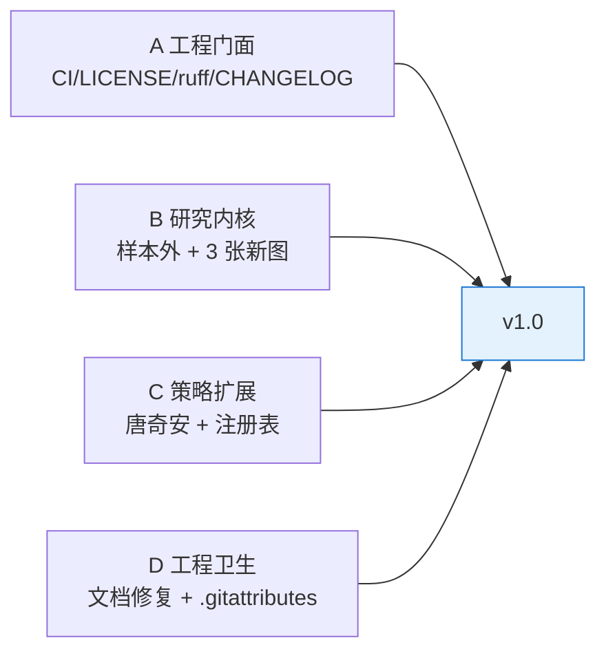
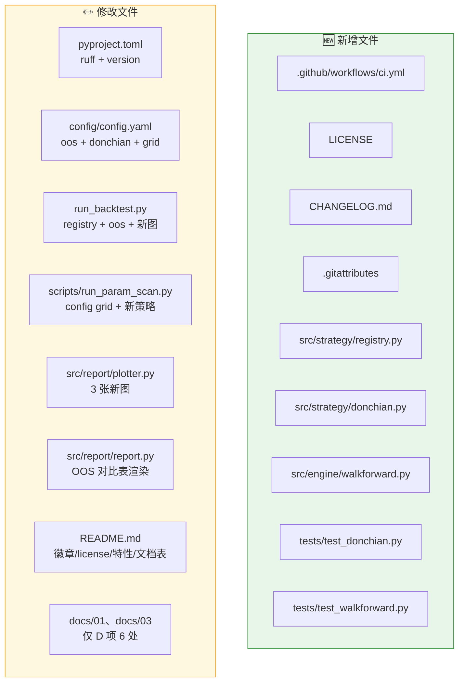
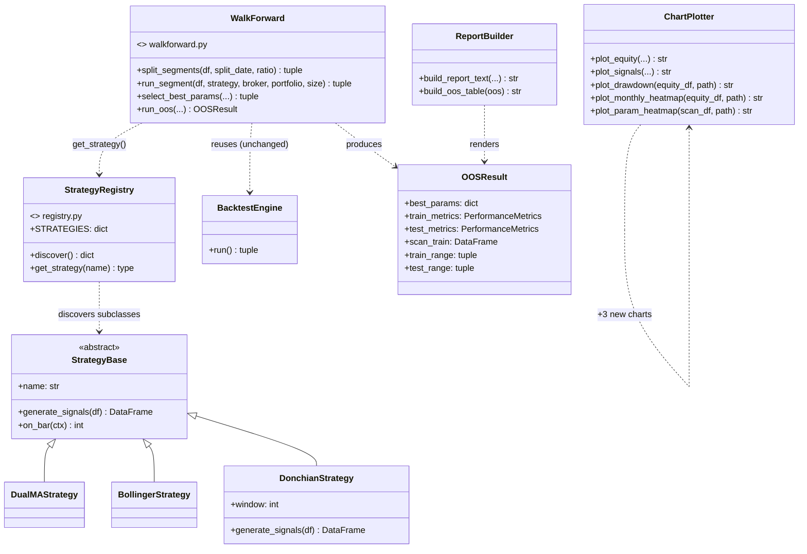
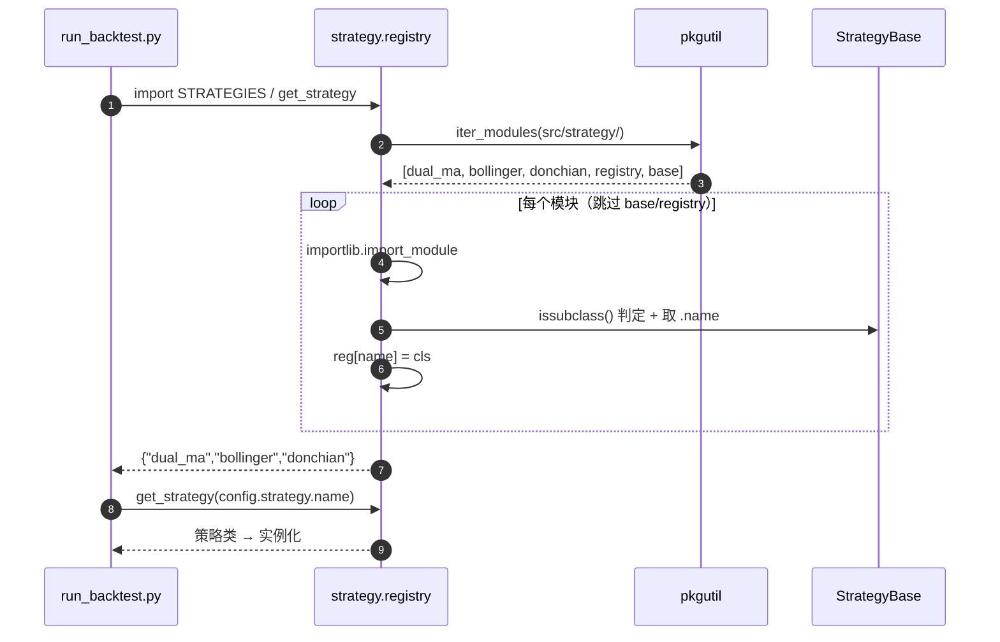
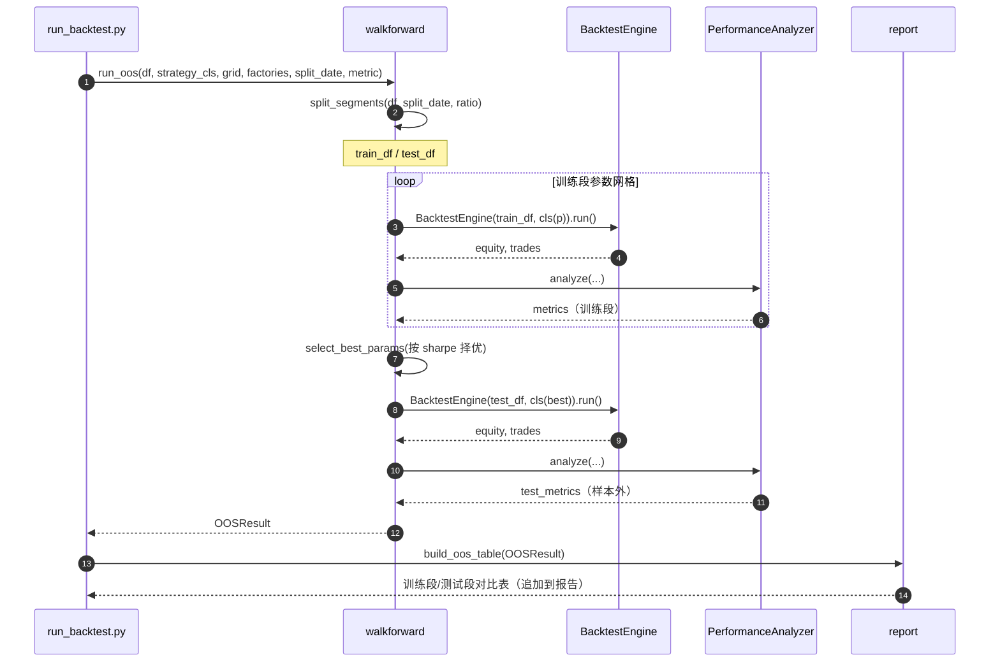
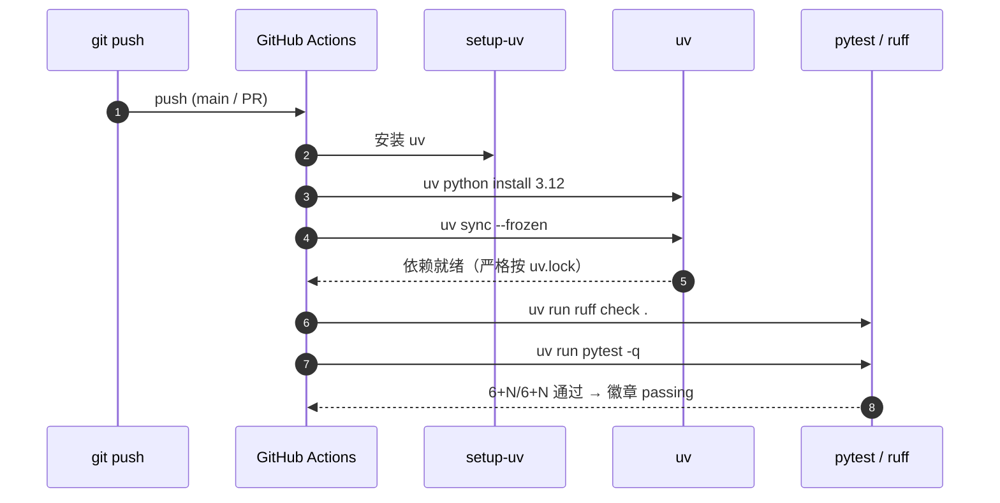
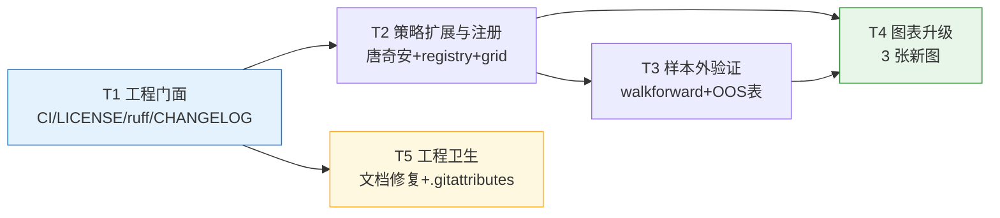

# 05 增量设计与任务列表 —— v1.0「交付级完善」

> **文档类型**：增量系统设计 + 任务分解（架构师产出）
> **项目**：quant-demo（基准：MVP 已上线，T1~T9 全实现，单测 6/6 通过，C0 近 5 年 1211 根日线回测跑通）
> **仓库**：https://github.com/Eeyore104/quant-demo （public / main）
> **目标版本**：v1.0「可交付项目」
> **编写日期**：2026-10-08
> **关联文档**：`01-量化背景与前置需求`｜`02-PRD`｜`03-系统设计与任务分解`｜`04-增量PRD-v1.0`
> **写作原则**：全中文 · 结论先行 · 只写增量 · 表格化 · 面向工程师可直接编码
> **硬约束**：文档 01~03 存在**已决定保留的未提交格式化改动**，本轮**只做** PRD D 项列出的精准修复，**不得回退或重排**其它内容。

---

## 0. 一页速览（结论先行）

| 关键问题 | 结论 |
|---|---|
| 本轮对**回测调用链**的唯一实质改动 | **V1-5 样本外验证**——通过**新增模块 + 配置开关**接入，**engine.run() 签名与行为完全不动** |
| 如何保证既有 6 个单测不受影响 | 既有 6 测**不 import** `run_backtest.py` / registry / 新策略；本轮**不改** `strategy/base.py`、`engine/engine.py`、`broker.py`、`metrics.py` 的既有函数 |
| 「新增策略 = 新增一个文件」如何落地 | 新增 **策略自动发现注册表** `src/strategy/registry.py`（`pkgutil` 扫描），`run_backtest`/`param_scan` 改用 `get_strategy(name)` |
| 参数扫描如何自动纳入新策略 | 扫描器改为**读 config 里该策略的 grid**（`strategy.grid[name]`），策略无需改扫描代码 |
| CI 如何与本地一致 | `.github/workflows/ci.yml` 复用 uv：`uv sync --frozen` + `uv run pytest`（+ `uv run ruff check`） |
| 任务数 | **5 个**（T1 门面 / T2 策略扩展与注册 / T3 样本外 / T4 图表 / T5 工程卫生） |



---

## 1. 增量总览与影响面

### 1.1 需求 → 设计映射

| 需求 | 本轮设计动作 | 触及层 |
|---|---|---|
| V1-1 CI | 新增 `.github/workflows/ci.yml`（uv 流程）+ README 徽章 | 仓库根 |
| V1-2 LICENSE | 新增 `LICENSE`（MIT / Eeyore104 / 2026）+ README 链接 | 仓库根 |
| V1-3 ruff | `pyproject.toml` 加 `[tool.ruff]`，全量 format，重跑 pytest | 工程配置 |
| V1-4 CHANGELOG | 新增 `CHANGELOG.md`（0.1.0 → 1.0.0），`pyproject` version 改 1.0.0 | 仓库根 |
| V1-5 样本外 | 新增 `src/engine/walkforward.py` + config `backtest.oos` + 报告对比表 | 引擎（增量旁路） |
| V1-6 图表 | `src/report/plotter.py` 新增 3 图 + run_backtest/param_scan 接线 | 报告层 |
| V1-7 唐奇安 | 新增 `src/strategy/donchian.py` + `src/strategy/registry.py`（自动发现） | 策略层 |
| V1-8 文档修复 | `docs/01` 5 处 + `docs/03` 1 处，**精准替换** | 文档 |
| V1-9 行尾 | 新增 `.gitattributes` + `git add --renormalize .` | 仓库根 |

### 1.2 影响面（新增 vs 修改）



> **不动清单（红线）**：`src/strategy/base.py`、`src/strategy/dual_ma.py`、`src/strategy/bollinger.py`、`src/engine/engine.py`、`src/engine/broker.py`、`src/engine/portfolio.py`、`src/report/metrics.py`、`src/utils/*`、`tests/test_cleaner.py`、`tests/test_engine.py`、`tests/test_metrics.py` 的**既有函数签名与逻辑均不改**。

---

## 2. 关键技术设计（三个重点）

### 2.1 【重点 1】V1-5 样本外验证——如何注入而不破坏现有引擎

**设计原则**：**旁路增强，零侵入**。`BacktestEngine.__init__` 与 `.run()` 的签名、返回值、成交约定**一律不动**；样本外验证作为**新模块**在其上层编排。

**注入方式（三段式）**：

```
clean df ──► split_segments() ──► train_df / test_df
                │
   ① 训练段：用 grid 扫描 → 择优参数 best_params（按 sharpe）
                │
   ② 测试段：用 best_params 在 test_df 上跑一次（样本外检验）
                │
   ③ 汇总：train_metrics vs test_metrics → 对比表
```

**接口签名（新增模块 `src/engine/walkforward.py`，全部复用现有 `BacktestEngine`）**：

```python
@dataclass
class OOSResult:
    best_params: dict  # 训练段择优参数
    train_metrics: PerformanceMetrics
    test_metrics: PerformanceMetrics
    scan_train: pd.DataFrame  # 训练段参数扫描明细
    train_range: tuple  # (起, 止)
    test_range: tuple


def split_segments(df, split_date=None, ratio=0.7) -> tuple[pd.DataFrame, pd.DataFrame]:
    """按日期切分：<=split_date 为训练段，>split_date 为测试段；
    未给 split_date 时按 ratio 比例切分。split_date 优先。"""


def run_segment(df, strategy, broker, portfolio, position_size) -> tuple[pd.DataFrame, list]:
    """薄封装：new BacktestEngine(df, strategy, ...).run()，引擎零改动。"""


def select_best_params(
    train_df, strategy_cls, grid, broker_factory, portfolio_factory, position_size, metric="sharpe"
) -> tuple[dict, pd.DataFrame]:
    """训练段参数网格扫描，按 metric 择优，返回 (best_params, 明细表)。"""


def run_oos(
    df,
    strategy_cls,
    grid,
    broker_factory,
    portfolio_factory,
    position_size,
    split_date=None,
    ratio=0.7,
    metric="sharpe",
) -> OOSResult:
    """完整样本外流程：切分 → 训练段择优 → 测试段检验 → 汇总。"""
```

**关键点**：
- `describe` 只**新增**模块，`engine/engine.py` 一行不改 → 既有 `test_engine.py`（2 测）必然通过。
- `broker_factory / portfolio_factory` 用**工厂函数**而非实例，因为每格参数需全新 `Broker/Portfolio`（避免状态串味）——与 `scripts/run_param_scan.py` 现有写法一致。
- 若 `test` 段为空（数据太短），`run_oos` 返回 `test_metrics=空` 并**打 WARN 日志**，不抛异常（保证一键运行不崩）。

**配置注入**（`config/config.yaml` 新增，**默认开启但不影响老逻辑**）：

```yaml
backtest:
  # ...（既有字段不动）
  oos:
    enabled: true               # 是否在 run_backtest 末尾追加样本外验证
    split_date: "2024-10-01"    # 训练段 <= 该日 < 测试段（优先）
    ratio: 0.7                  # 未指定 split_date 时按比例切分
    metric: "sharpe"            # 训练段择优指标
```

**报告呈现（V1-5 验收②）**：`src/report/report.py` 新增 `build_oos_table(oos: OOSResult) -> str`，输出"训练段 / 测试段对比表"（至少含 收益 / 最大回撤 / 夏普），并**明确标注**哪段是样本内、哪段是样本外：

```
============= 样本外验证（训练段择优 → 测试段检验）=============
阶段         区间                        累计收益   最大回撤   夏普
样本内(训练)  2021-10-01 ~ 2024-09-30     +8.20%    -6.10%    0.52   ← 用于择优
样本外(测试)  2024-10-01 ~ 2026-10-01     -1.30%    -7.40%   -0.11   ← 检验
择优参数      fast=5, slow=60
=================================================================
```

**保证既有 6 单测不受影响**：新逻辑全在 `walkforward.py` + `run_backtest.py`（脚本级）；既有测试文件不 import 这两者。新增 1 个 `tests/test_walkforward.py`（覆盖 `split_segments` 边界与 `run_oos` 端到端小样本）。

### 2.2 【重点 2】V1-7 策略注册/发现机制——「新增策略 = 新增一个文件」

**现状**：`run_backtest.py` 里硬编码 `STRATEGIES = {"dual_ma": ..., "bollinger": ...}` —— 新增策略要改入口文件，违背"扩展性"叙事。

**设计**：新增 `src/strategy/registry.py`，用 `pkgutil.iter_modules` **自动扫描** `src/strategy/` 目录下所有模块，收集 `StrategyBase` 子类（按类属性 `name` 注册）。

```python
# src/strategy/registry.py
import importlib, inspect, os, pkgutil
from .base import StrategyBase

_PKG = __name__.rsplit(".", 1)[0]  # "src.strategy"
_DIR = os.path.dirname(__file__)


def discover() -> dict[str, type[StrategyBase]]:
    reg: dict[str, type[StrategyBase]] = {}
    for m in pkgutil.iter_modules([_DIR]):
        if m.name in {"base", "registry"}:
            continue
        module = importlib.import_module(f"{_PKG}.{m.name}")
        for _, obj in inspect.getmembers(module, inspect.isclass):
            if (
                issubclass(obj, StrategyBase)
                and obj is not StrategyBase
                and obj.__module__ == module.__name__
            ):  # 只收本模块定义的类
                reg[obj.name] = obj
    return reg


STRATEGIES: dict[str, type[StrategyBase]] = discover()


def get_strategy(name: str) -> type[StrategyBase]:
    if name not in STRATEGIES:
        raise KeyError(f"未知策略: {name}（可用: {sorted(STRATEGIES)}）")
    return STRATEGIES[name]
```

**接入**（改造两处调用，**引擎不动**）：
- `run_backtest.py`：`from src.strategy.registry import get_strategy` → `strategy = get_strategy(name)(params)`。
- `scripts/run_param_scan.py`：改为**从 config 读该策略的 grid** 并用 `get_strategy(name)` 实例化 → 新策略**自动**可被扫描。

**配置驱动**（`config/config.yaml` 新增 `strategy.grid`）：

```yaml
strategy:
  name: "dual_ma"
  params:
    dual_ma:    { fast: 5, slow: 20 }
    bollinger:  { window: 20, num_std: 2.0 }
    donchian:   { window: 20 }          # 新策略参数（新增）
  grid:                                  # 参数扫描网格（每个策略一份）
    dual_ma:   { fast: [5,10,15], slow: [20,40,60] }
    bollinger: { window: [10,20,30], num_std: [1.5,2.0,2.5] }
    donchian:  { window: [10,20,30,55] }
```

**效果**：理论上新增 `src/strategy/xxx.py`（定义 `class XxxStrategy(StrategyBase): name="xxx"`）→ **无需改引擎、改入口**，即可被 `strategy.name` 切换、被参数扫描选中。✅ 满足 V1-7 验收②③⑤。

**兼容性**：`base.py` / `dual_ma.py` / `bollinger.py` 一行不改；`registry.py` 只**新增**。既有 6 测不 import registry → 不受影响。

### 2.3 【重点 3】V1-1 CI——复用本地 uv 流程

**设计**：`.github/workflows/ci.yml`，用官方 `astral-sh/setup-uv` + `uv sync --frozen`，与本地 `uv run` 完全一致。

```yaml
name: CI
on:
  push:
  pull_request:
jobs:
  test:
    runs-on: ubuntu-latest
    steps:
      - uses: actions/checkout@v4
      - uses: astral-sh/setup-uv@v5
        with:
          enable-cache: true
      - name: Set up Python
        run: uv python install 3.12        # 与 .python-version 一致
      - name: Install deps
        run: uv sync --frozen              # 严格按 uv.lock，避免漂移
      - name: Lint
        run: uv run ruff check .           # V1-3：lint 纳入 CI（PRD Q3 建议）
      - name: Test
        run: uv run pytest -q
```

**徽章（README 顶部）**：
```

```
> `uv sync --frozen` 要求 `uv.lock` 已提交（当前仓库已有）→ 保证 CI 与本地依赖一致（PRD Q8：Python 3.12）。

---

## 3. 类图变更（增量）



> 图例：`<<module>>` 为模块级函数集合，非类。**改动仅"新增"**：`DonchianStrategy`、`StrategyRegistry`、`WalkForward`、`OOSResult`、`ReportBuilder.build_oos_table`、`ChartPlotter` 三个新方法。

---

## 4. 关键流程时序图（增量）

### 4.1 策略自动发现（启动时）



### 4.2 样本外验证（run_backtest 末尾，config 开关）



### 4.3 CI 流程



---

## 5. 文件变更清单

### 5.1 新增文件

| # | 文件（相对仓库根） | 用途 | 对应需求 |
|---|---|---|---|
| 1 | `.github/workflows/ci.yml` | CI：uv + ruff + pytest | V1-1 |
| 2 | `LICENSE` | MIT，署名 `2026 Eeyore104` | V1-2 |
| 3 | `CHANGELOG.md` | Keep a Changelog：`[1.0.0]` + `[0.1.0]` | V1-4 |
| 4 | `.gitattributes` | `* text=auto eol=lf` + 图片 `binary` | V1-9 |
| 5 | `src/strategy/registry.py` | 策略自动发现注册表 | V1-7 |
| 6 | `src/strategy/donchian.py` | 唐奇安通道策略 | V1-7 |
| 7 | `src/engine/walkforward.py` | 样本外验证编排（旁路） | V1-5 |
| 8 | `tests/test_donchian.py` | 新策略单测 | V1-7 |
| 9 | `tests/test_walkforward.py` | 样本外单测 | V1-5 |

### 5.2 修改文件

| # | 文件 | 改什么 | 对应需求 |
|---|---|---|---|
| 1 | `pyproject.toml` | `version 0.1.0 → 1.0.0`；新增 `[tool.ruff]` | V1-3/V1-4 |
| 2 | `config/config.yaml` | 新增 `backtest.oos`、`strategy.params.donchian`、`strategy.grid` | V1-5/V1-7 |
| 3 | `run_backtest.py` | 改用 `get_strategy`；末尾按开关跑 OOS；接 3 张新图 | V1-5/V1-6/V1-7 |
| 4 | `scripts/run_param_scan.py` | 读 config grid + `get_strategy`；输出参数扫描热力图 | V1-6/V1-7 |
| 5 | `src/report/plotter.py` | 新增 `plot_drawdown` / `plot_monthly_heatmap` / `plot_param_heatmap` | V1-6 |
| 6 | `src/report/report.py` | 新增 `build_oos_table`；`build_report_text` 支持追加 OOS 段 | V1-5 |
| 7 | `README.md` | CI 徽章、License、特性补 OOS/新图/新策略、目录表补 `docs/04`、Roadmap | V1-1~V1-7 |
| 8 | `docs/01-量化背景与前置需求.md` | **仅** 5 处精准修复（D-1~D-5） | V1-8 |
| 9 | `docs/03-系统设计与任务分解.md` | **仅** 1 处精准修复（D-6） | V1-8 |

### 5.3 V1-8 精准修复明细（逐字，工程师照做）

| # | 文件 | 位置 | 现状 | 应改为 |
|---|---|---|---|---|
| D-1 | `docs/01` | 第 76 行 | `&#x662F;` | `是` |
| D-2 | `docs/01` | 第 226 行 | `2000~~2400` | `2000~2400` |
| D-3 | `docs/01` | 第 226 行 | `3400~~4100` | `3400~4100` |
| D-4 | `docs/01` | 第 235 行 | `2155~~2250` | `2155~2250` |
| D-5 | `docs/01` | 第 235 行 | `2000~~2376` | `2000~2376` |
| D-6 | `docs/03` | 第 274 行表格 | `**pycache**` | `` `__pycache__` `` |

> 修复判据：文档中**不应再出现** `~~`（双波浪线）与 `&#x`（HTML 实体残留）。**其它格式化改动一律不动。**

---

## 6. 任务分解（T1~T5）

> 规则：按**功能模块分组**（非单文件）；每任务 ≥3 个文件；第一个任务是基础设施与门面；任务间**尽量并行**、仅少量线性依赖。

### T1 工程门面（CI / LICENSE / ruff / CHANGELOG / 版本号）

- **目标**：让仓库"第一眼可信"——CI 绿标、许可证、代码规范、变更可追溯。
- **涉及文件**：
  - `.github/workflows/ci.yml`（新增）
  - `LICENSE`（新增）
  - `CHANGELOG.md`（新增）
  - `pyproject.toml`（`[tool.ruff]` + version→1.0.0）
  - `README.md`（CI 徽章 + License 行）
- **前置依赖**：无（可最先开始）。
- **验收点**：① push 后 Actions 自动触发且徽章 passing；② GitHub 侧栏识别 MIT；③ `uv run ruff check .` 无错、`uv run ruff format --check .` 通过；④ **格式化后重跑 `uv run pytest` 仍 6/6**；⑤ `CHANGELOG.md` 含 `[1.0.0]`（建议回溯 `[0.1.0]`）。

### T2 策略扩展与注册机制（唐奇安 + 自动发现 + 配置网格）

- **目标**：证明"新增策略 = 新增一个文件"，且配置可切换、参数扫描自动纳入。
- **涉及文件**：
  - `src/strategy/registry.py`（新增，`pkgutil` 自动发现）
  - `src/strategy/donchian.py`（新增，`name="donchian"`，参数 `window`，双向突破）
  - `config/config.yaml`（新增 `strategy.params.donchian` + `strategy.grid`）
  - `scripts/run_param_scan.py`（改为读 config grid + `get_strategy`）
  - `run_backtest.py`（入口改用 `get_strategy`）
  - `tests/test_donchian.py`（新增）
- **前置依赖**：T1（需 ruff 规范化后的基线；逻辑上可并行，建议排在 T1 之后避免格式冲突）。
- **验收点**：① `STRATEGIES` 自动含 `donchian`；② `config.strategy.name=donchian` 一键跑通；③ 参数扫描能对 donchian 输出对比表；④ **`base.py`/`dual_ma.py`/`bollinger.py`/`engine/*` 零改动**；⑤ 既有 6 测仍通过 + 新增 donchian 测通过。

### T3 样本外验证（V1-5）

- **目标**：训练段择优 → 测试段检验，输出"样本内/样本外对比表"，防过拟合。
- **涉及文件**：
  - `src/engine/walkforward.py`（新增，旁路编排，复用 `BacktestEngine`）
  - `config/config.yaml`（新增 `backtest.oos`）
  - `src/report/report.py`（新增 `build_oos_table`）
  - `run_backtest.py`（按 `oos.enabled` 追加 OOS 段）
  - `tests/test_walkforward.py`（新增）
- **前置依赖**：T2（需要 registry 取策略类；`run_backtest` 已被 T2 改写）。
- **验收点**：① 可配置 `split_date`（优先）或 `ratio`；② 报告含训练/测试对比表（收益/回撤/夏普）并标注样本内外；③ **`engine.run()` 与既有 6 测不受影响**；④ 新增 ≥1 个 OOS 单测通过。

### T4 图表升级（V1-6）

- **目标**：在既有 2 图基础上新增 3 图，风格统一、中文正常。
- **涉及文件**：
  - `src/report/plotter.py`（新增 `plot_drawdown` / `plot_monthly_heatmap` / `plot_param_heatmap`）
  - `run_backtest.py`（接线回撤图 + 月度热力图）
  - `scripts/run_param_scan.py`（接线参数扫描热力图）
  - `README.md` + `docs/images/`（更新截图）
- **前置依赖**：T2（参数扫描产出数据）、T3（权益曲线已含 OOS 场景）。
- **验收点**：① 回撤区间图标注最大回撤区间；② 月度收益热力图按 年×月 排列；③ 参数扫描热力图色阶显示绩效；④ 全部输出到 `output/` 且中文正常。

### T5 工程卫生（文档修复 + .gitattributes + 行尾归一）

- **目标**：仓库整洁、无 CRLF 噪音、文档零瑕疵。
- **涉及文件**：
  - `docs/01-量化背景与前置需求.md`（D-1~D-5）
  - `docs/03-系统设计与任务分解.md`（D-6）
  - `.gitattributes`（新增）
  - 执行 `git add --renormalize .`
- **前置依赖**：无（独立，可并行）。
- **验收点**：① 6 处精准修复完成，且**未回退其它格式化改动**；② `.gitattributes` 至少含 `* text=auto eol=lf`，图片声明 `binary`；③ renormalize 后 `git status` 无 CRLF 警告；④ 归一化后 `uv run pytest` 仍 6/6。

### 任务依赖图



> **并行建议**：T1 与 T5 可同时开工；T2 完成后 T3、T4 可并行（T4 需 T3 的权益结构，但主体可先做）。

---

## 7. 依赖与配置变更

### 7.1 依赖变更

| 包 | 变更 | 用途 |
|---|---|---|
| `ruff` | **新增**（dev） | lint + format（V1-3） |
| 其余依赖 | 不变 | akshare / pandas / numpy / matplotlib / pyyaml / pytest |

`pyproject.toml` 追加：

```toml
[dependency-groups]
dev = ["pytest>=8", "ruff>=0.6"]

[tool.ruff]
line-length = 100
target-version = "py312"

[tool.ruff.lint]
select = ["E", "F", "I", "UP", "B"]   # 基础 + import 排序 + 现代语法
```

### 7.2 配置变更（`config/config.yaml` 增量）

```yaml
backtest:
  # 既有字段保持不变 ...
  oos:
    enabled: true
    split_date: "2024-10-01"
    ratio: 0.7
    metric: "sharpe"

strategy:
  name: "dual_ma"
  params:
    dual_ma:   { fast: 5, slow: 20 }
    bollinger: { window: 20, num_std: 2.0 }
    donchian:  { window: 20 }
  grid:
    dual_ma:   { fast: [5,10,15], slow: [20,40,60] }
    bollinger: { window: [10,20,30], num_std: [1.5,2.0,2.5] }
    donchian:  { window: [10,20,30,55] }
```

---

## 8. 共享知识（增量约定）

| 项 | 约定 |
|---|---|
| **策略注册** | 新策略只需：新建 `src/strategy/<name>.py`，定义 `class XxxStrategy(StrategyBase)` 且类属性 `name="<name>"`；**禁止**在 `registry.py` 硬编码名单。 |
| **参数扫描** | 网格统一放 `config.strategy.grid.<name>`；扫描器遍历 `itertools.product`，跳过非法组合（如 `fast>=slow`）。 |
| **样本外分段** | `split_date` 优先（`<=` 归训练段、`>` 归测试段）；未给则按 `ratio` 切分；测试段为空只 WARN 不崩。 |
| **OOS 择优指标** | 默认 `sharpe`，可配 `metric`（`total_return`/`max_drawdown`/`sharpe`）。 |
| **图表风格** | 复用 `plotter.py` 顶部字体（Microsoft YaHei）与配色（`#1976d2` 主色）；新图 `dpi=120`、`fig.tight_layout()`。 |
| **文档修复** | 只做 D 项 6 处**精准替换**；不得 `format-on-save` 全量重排 docs/01~03。 |
| **行尾** | 全仓库统一 LF（`.gitattributes: * text=auto eol=lf`）；`*.png` 等二进制显式 `binary`。 |
| **版本号** | `pyproject.toml version = "1.0.0"`；`CHANGELOG.md` 顶部 `[Unreleased]`，其次 `[1.0.0] - 2026-10-08`。 |
| **CI 触发** | `on: push`（所有分支）+ `on: pull_request`。 |

---

## 9. 回归保证策略（如何确保既有 6 单测不受影响）

| 改动 | 风险 | 保证措施 |
|---|---|---|
| `run_backtest.py` 改写 | 低 | 既有测试**不 import** 该脚本；脚本级改动不影响单元测试 |
| 新增 `registry.py` | 低 | 纯新增模块；不修改 `base.py` 类签名 |
| 新增 `donchian.py` | 低 | 纯新增文件；`base.py`/`dual_ma.py`/`bollinger.py` 零改动 |
| 新增 `walkforward.py` | **中**（唯一需回归项） | **不改** `engine/engine.py` 的 `__init__/run` 签名与行为；仅"调用"引擎 |
| ruff 全量格式化 | **中** | 格式化后**必须**立即 `uv run pytest` 复验 6/6；CI 亦会拦截 |
| `.gitattributes` renormalize | 低 | 仅行尾归一；归一后重跑 pytest 6/6 |

**回归门禁**：每个任务完成时执行 `uv run ruff check . && uv run pytest`，全绿方可进入下一任务；CI 提供二次保障。

---

## 10. 待明确事项

| # | 事项 | 建议默认值 | 需谁拍板 |
|---|---|---|---|
| U1 | CHANGELOG 是否回溯 `[0.1.0]` | 回溯（PRD Q1 建议） | 用户 |
| U2 | ruff 是否纳入 CI 必过（含 format） | lint 必过；format 仅本地检查（PRD Q3） | 用户 |
| U3 | 样本外分段方式 | 支持 `split_date`（优先）+ `ratio`（PRD Q4） | 用户 |
| U4 | 唐奇安默认通道周期 | `20`（PRD Q6 建议） | 用户 |
| U5 | MIT 署名年份 | `2026 Eeyore104`（PRD Q7） | 用户 |
| U6 | 参数扫描热力图是否复用现有扫描输出 | 是（PRD Q5） | 用户 |
| U7 | 月度收益热力图口径 | 按**权益**月收益（非价格） | 用户/工程师 |
| U8 | `DonchianStrategy` 是否做上下轨突破双向 | 双向（与期货可做空一致） | 用户 |

---

> 本文档为《05 增量设计与任务列表 v1.0》，配套图见 `docs/class-diagram-v1.mermaid` 与 `docs/sequence-diagram-v1.mermaid`。
> 上游：《04-增量PRD-v1.0》。下游：由工程师（寇豆码）按第 6 章 T1~T5 实现。
