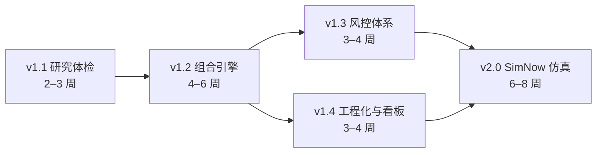

# 07 · 框架补齐路线图（v1.1 → v2.0）

> **文档性质**：规划方案（待评审）。评审通过后按版本逐项落地，每个版本开工前再拆「任务列表」文档（沿用 03/05 的流程）。
> **前置状态**：v1.0 已验收（见 `06-验收报告-v1.0.md`）；本路线图基于 2026-10-09 需求访谈（两轮共 7 问）锁定。
> **生成日期**：2026-10-09

---

## 0. 一句话结论

从 v1.0「回测闭环」到「功能完善的量化交易框架」，还差 **5 个版本、约 4–6 个月**（按每周 5–10 小时估算）：

**v1.1 研究体检 → v1.2 组合引擎 → v1.3 风控体系 → v1.4 工程化与看板 → v2.0 SimNow 仿真**

两项目标同时达成：① 通用向求职作品集（工程素养 + 量化深度双配重）；② 半年内跑通仿真。

## 1. 需求基线（2026-10-09 锁定）

| 维度 | 锁定结论 | 说明 |
|---|---|---|
| 项目定位 | 求职作品集升级（通用向） | 目标岗位未定 → 「工程素养」与「量化深度」双配重，不押注单一方向 |
| 实盘目标 | 半年内跑通 SimNow 仿真；实盘视机会再定 | 实盘前置合规：程序化交易报备（证监会〔2025〕12 号） |
| 数据频率 | 日线为主 | 分钟级 / Tick 列入 v2.1+ 展望；数据层按「可换源、可升级粒度」设计 |
| 补齐重点 | 四块全要：研究严谨性 / 组合与资金管理 / 风控与止损 / 工程化与看板 | 先后顺序即本路线图的版本序 |
| 组合形态 | 多品种并行 + 组合汇总（第一版） | 各品种跑各自策略 → 组合级资金 / 权益 / 风险汇总 |
| 投入节奏 | 按每周 5–10 小时「稳步档」估算 | 每版周期可调速；任务切小、文档写全，随时可捡起 |

## 2. 能力现状 vs 缺口（对照表）

| 能力层 | 已具备（v1.0） | 主要缺口 |
|---|---|---|
| 数据层 | akshare 拉取 · CSV 缓存 · 清洗 · 83 个品种清单 | 本地数据库 · 分钟级数据 · 换月拼接口径 · 数据质量校验 |
| 策略层 | 统一接口 + 自动注册表 · 双均线 / 布林 / 唐奇安 | 参数优化器 · 因子工具箱（低优先）· 多信号合成 |
| 回测引擎 | 单品种 · 事件驱动 · T+1 开盘成交 · 手续费 / 滑点 · 防未来函数 | 保证金与逐日盯市 · 多品种组合 · 涨跌停 / 流动性约束 |
| 研究严谨性 | 样本外验证 · 参数扫描网格 · 10 项绩效指标 | 蒙特卡洛 / 随机对照 · Deflated Sharpe · 成本敏感性放大 · 参数邻域细检 |
| 组合与风控 | ——（空白：单品种、固定 1 手） | 资金分配 · 仓位管理 · 止损止盈 · 熔断 · 压力测试 · VaR/CVaR |
| 执行与实盘 | ExecutionAdapter 接口（预留） | SimNow 仿真 · CTP 通道 · 订单 / 状态管理 · 监控告警 · 报备流程 |
| 工程与展示 | uv · ruff · pytest · CI · PNG 报告 | 数据库 · HTML 报告 / Web 看板 · 调度告警 · 数据校验 |

## 3. 版本总览

| 版本 | 主题 | 核心交付 | 建议周期 | 依赖 | 完成标志（验收线） |
|---|---|---|---|---|---|
| v1.1 | 研究体检补全 | 过拟合四件套补齐 + 体检报告章节 | 2–3 周 | 无（现状即可） | 任一策略一键生成完整「过拟合体检」报告 |
| v1.2 | 组合引擎 | 多品种并行 + 组合资金 / 保证金 + 组合报告 | 4–6 周 | v1.1 | 配置 5–8 品种池 → 一条命令输出组合级回测报告 |
| v1.3 | 风控体系 | 仓位管理 · 止损止盈 · 熔断 · 压力测试 · 涨跌停约束 | 3–4 周 | v1.2 | 风控全部配置化开关；报告含风险与压力测试章节 |
| v1.4 | 工程化与看板 | 数据库 · 数据校验 · HTML 报告 · Web 看板 · 调度告警 | 3–4 周 | v1.2（可与 v1.3 穿插） | 浏览器看板可展示；「数据更新→跑批→报告」一条命令 |
| v2.0 | SimNow 仿真 | 环境接入 · 执行适配器 · 风控前置 · 监控 · 连续跑通 | 6–8 周 | v1.3 + v1.4 | 连续 5+ 交易日无人值守：信号→下单→回报→日报 |
| v2.1+ | 展望 | 实盘准备 · 分钟级 · 参数优化器 · 多策略组合 | 视情况 | — | — |

> 合计约 18–25 周 ≈ 4–6 个月。若想「仿真」再提前：可把 v1.4 的看板部分延后到 v2.0 之后，压缩约 3 周。
> 与 README「M6–M9」的关系：M6–M7（研究平台化 + 仿真）细化 = v1.2–v1.4 + v2.0；M8–M9（看板 + 实盘准备）= v1.4 + v2.1+。

## 4. 各版本详细规划

### v1.1 · 研究体检补全（2–3 周）

**目标**：把「过拟合体检」从一半补到完整——研究结论能经得起「你凭什么觉得这不是过拟合」的追问。

任务清单：

- **T1.1-1 参数敏感性升级**：现有粗网格 → 邻域细网格；自动识别「悬崖式衰减」（相邻参数断崖报警）；热力图标注稳健区域。
- **T1.1-2 蒙特卡洛 / 随机对照**：① 随机策略基准（同频率随机信号 × N 次，检验真实策略是否显著优于随机分布）；② 交易重排 / bootstrap 路径 → 收益、回撤分布与分位数。
- **T1.1-3 Deflated Sharpe（多重试验校正）**：按参数扫描的实际试验次数校正夏普（Bailey & López de Prado 方法），输出「校正后夏普」与显著性结论。
- **T1.1-4 成本敏感性**：成本 ×1.5 / ×2 / ×3 复跑，输出「收益归零成本倍数」——直观回答「这策略需要多低的成本才成立」。
- **T1.1-5 报告整合**：报告新增「过拟合体检」章节：四件套一览表（含样本外使用次数登记）+ 总判定（通过 / 存疑 / 不通过）。

**验收**：`uv run python run_backtest.py` 一键产出含完整体检章节的报告；三个内置策略跑通；CI 绿。

**作品集亮点**：别的项目晒收益曲线，你晒「体检报告 + 主动暴露的过拟合结论」——绝大多数个人项目没有的诚实与严谨。

### v1.2 · 组合引擎（4–6 周）

**目标**：单品种 → 「多品种并行 + 组合汇总」（本次锁定的第一版组合形态）。

任务清单：

- **T1.2-1 标的池配置**：config 支持品种列表（建议 5–8 个、跨 2–3 个板块）；批量拉取 / 缓存；交易日历对齐与缺失处理。
- **T1.2-2 多品种并行回测**：品种 × 策略映射（每品种可独立配策略与参数）；统一调度跑批、结果聚合。
- **T1.2-3 组合资金与保证金**：初始资金分配（第一版：等权 / 波动率倒数 两种 baseline）；保证金占用追踪（按合约保证金率近似）；组合可用资金约束（超限提示 / 拒绝开仓）。
- **T1.2-4 结算与盯市口径**：期货视角补齐「每日盯市 / 结算」近似口径（结算盈亏、权益、保证金占用逐日更新），口径写入文档。
- **T1.2-5 组合报告**：组合权益曲线与回撤；品种贡献分解（收益 / 风险）；相关性矩阵热力图；权重与持仓分布图。
- **T1.2-6 换月与拼接口径**：明确主连拼接序列的近似性质；换月点标注；将「拼接跳空」登记为数据口径风险（不把拼接损益当策略能力）。

**验收**：config 配好品种池 → 一条命令输出组合级报告；含逐品种 vs 组合对比表；CI 绿、新增模块有单测。

**作品集亮点**：「单品种 demo → 组合系统」是质变；相关性 / 贡献分解 / 资金约束是机构语言。

### v1.3 · 风控体系（3–4 周）

**目标**：回答面试高频问题「你最大风险是什么、怎么控制」——先想清楚能亏多少，再谈能赚多少。

任务清单：

- **T1.3-1 仓位管理**：固定手数 → 风险目标头寸（波动率目标 / ATR 头寸）；单品种敞口上限、组合总敞口上限。
- **T1.3-2 止损止盈**：固定比例 / ATR 倍数 / 移动止损；明确触发口径（与 T+1 成交约定兼容，防未来函数）。
- **T1.3-3 组合熔断**：触发条件（组合回撤阈值 / 单日亏损阈值 / 连续亏损）→ 动作（降杠杆 / 暂停新开仓 / 全平）+ 恢复条件；熔断事件全日志。
- **T1.3-4 压力测试**：历史情景（历史极端波动段）+ 假设情景（跳空、连续涨跌停）→ 组合损失估计；蒙特卡洛回撤分布（复用 T1.1-2 设施）。
- **T1.3-5 风险指标**：日频 VaR / CVaR；品种与板块集中度；相关性预警。
- **T1.3-6 涨跌停与流动性约束**：停板不可成交近似；成交量参与率上限（下单量 ≤ 当日成交量 × 参与率）。

**验收**：风控全部 config 化开关；报告新增「风险与压力测试」章节；熔断触发场景可在回测中复现并出日志。

**作品集亮点**：「止损 / 熔断 / 压力测试」三个词出现在报告里，胜过十句自我介绍。

### v1.4 · 工程化与看板（3–4 周，可与 v1.3 穿插）

**目标**：好用 + 好看——把「数据 → 回测 → 报告」变成顺手的一键流程，并做出可交互的展示面。

任务清单：

- **T1.4-1 本地数据库**：SQLite 起步（建议；零额外依赖）管理行情 / 回测结果 / 交易记录；行情可选 Parquet；保留 CSV 兼容。
- **T1.4-2 数据质量校验**：缺口检测、异常值、交易日对齐、数据版本标记；输出「数据质量报告」。
- **T1.4-3 HTML 报告**：每次回测生成自包含静态 HTML 报告（可分享、可存档）——面试直接发文件。
- **T1.4-4 Web 看板（轻量先行）**：Streamlit（建议先做）展示：权益 / 回撤、品种贡献、体检结论卡、参数热力图；后续可选升级 FastAPI + Vue3（复用你的前端技能）。
- **T1.4-5 调度与告警**：每日定时「数据更新 → 信号 / 回测 → 报告」；失败告警（邮件 / 企业微信 webhook）；日志体系增强。

**验收**：浏览器打开看板可交互展示历史回测结果；一条命令完成「数据更新 → 跑批 → 出报告」；定时任务无人值守可跑。

**作品集亮点**：看板截图 = README 门面；「数据 → 调度 → 看板」是数据工程素养的直接证据。

### v2.0 · SimNow 仿真链路（6–8 周；目标半年内）

**目标**：策略在仿真环境跑通「信号 → 下单 → 成交回报 → 持仓 / 风控 → 日报」全链路，连续多个交易日无人值守。

任务清单：

- **T2.0-1 环境准备**：SimNow 注册（手机号即可、免费；注册与官网常在**交易时段**才可用；一个手机号一个模拟账户）；连接参数：BrokerID `9999`、AppID `simnow_client_test`、AuthCode 16 个 0、前置地址以官网「产品与服务」公告为准；SimNow 有「第一套（交易时段）」与「第二套 / 7×24（研发）」两套环境，先熟悉再动手。
- **T2.0-2 通道选型（二选一，开工前定）**：① **openctp-ctp**（推荐：`pip install openctp-ctp`，官方 CTPAPI 的 Python 封装，轻量、与自研引擎气质一致）；② vnpy（生态全但较重）。
- **T2.0-3 ExecutionAdapter 落地**：订单状态机（已报 / 部成 / 全成 / 已撤 / 拒单）；成交回报与持仓 / 资金同步；本地账 vs 柜台账对账。
- **T2.0-4 风控前置**：v1.3 风控规则实时化（下单前检查资金 / 仓位 / 熔断状态）。
- **T2.0-5 运行监控**：进程守护、断线重连（CTP 断连是常态）、信号 / 订单日志、每日仿真日报、异常告警（复用 T1.4-5）。
- **T2.0-6 验收**：连续 5+ 个交易日无人值守跑通；随机抽 3 天核对「回测信号 vs 仿真信号」一致性；输出仿真运行周报。

**合规**：SimNow 仿真不涉及实盘报备；**实盘前必须完成程序化交易报备并取得期货公司确认（证监会〔2025〕12 号）**。另：模拟 ≠ 实盘（模拟撮合宽松、无心理压力），仿真只验证工程链路，不代表实盘收益。

**作品集亮点**：「研究 → 组合 → 风控 → 仿真自动化」全链路是个人项目里罕见的完成度。

### v2.1+ 展望（可选，不排期）

| 方向 | 内容 | 触发条件 |
|---|---|---|
| 实盘准备 | 报备材料、小资金、风控加固 | 有稳定仿真记录 + 资金 / 时间允许 |
| 分钟级升级 | 数据层换源 + 执行节奏升级 | 有需要分钟级的策略 |
| 参数优化器 | 贝叶斯 / optuna 替代网格 | v1.1 体检后按需 |
| 多策略组合 | 单品种多策略叠加到组合层 | v1.2 组合层稳固后 |
| 因子工具箱 | 多因子研究设施 | 若转向多因子路线 |

## 5. 依赖关系

（v1.3 与 v1.4 可穿插并行；v2.0 需要两者都完成。）

## 6. 立即可做的并行事项（不占版本周期）

| 事项 | 说明 | 建议时点 |
|---|---|---|
| 本方案评审 | 锁定「待确认清单」（见第 8 节） | 现在 |
| README / 展示面盘点 | 轻量先行：把 v1.0 的展示面做成最佳状态 | 现在（低成本高回报） |
| SimNow 预研 | 读官网「产品与服务」；不必现在注册（账号有效期有限，建议 v1.4 启动时注册） | v1.4 |
| 期货公司接触 | 若考虑实盘：了解报备流程与仿真记录要求 | 仿真稳定后 |

## 7. 作品集展示面清单（通用向）

- **README 故事线**：问题 → 方案 → 证据（体检表 / 组合报告 / 看板截图）→ 工程素养（CI、测试、架构图）。
- **架构图更新**：把 03 文档的图升级为含「组合 / 风控 / 仿真」的 v2 版。
- **3 分钟演示路径**：一键回测 → 体检报告 → 组合报告 → 看板 → 仿真日报样例。
- **面试讲稿素材**：准备 3 个「主动暴露的坑」（成本吃掉收益 / 样本外使用次数 / 拼接跳空与模拟≠实盘）。
- **技术写作（可选）**：《我给自己的策略做了过拟合体检》——把 v1.1 过程写成文章。
- **代码质量**：保持 CI 常绿；每版新增模块带单测；视情况加类型标注检查。

## 8. 待确认清单（评审时逐项锁定）

| # | 决策点 | 我的建议 | 最晚需要定的时点 |
|---|---|---|---|
| 1 | 数据库选型 | SQLite（零依赖、够用） | v1.4 开工前 |
| 2 | 看板技术 | 先 Streamlit；后续可升级 FastAPI + Vue3 | v1.4 开工前 |
| 3 | 数据源升级 | 暂留 akshare；分钟级启动前再评估（如 tqsdk 等） | v1.4 / 分钟级 |
| 4 | CTP 通道库 | openctp-ctp（轻量，直连官方 CTPAPI）；备选 vnpy | v2.0 开工前 |
| 5 | 品种池范围 | 5–8 个主力连续、跨 2–3 个板块 | v1.2 开工前 |
| 6 | SimNow 注册时点 | v1.4 启动时（≈ 仿真开发前 2–4 周） | 到时提醒 |

## 9. 风险与合规

- **数据口径风险**：主连拼接序列 ≠「真实可交易合约组合」；换月点损益需单独归因，避免高估策略能力。
- **过拟合风险**：四件套是底线不是免死金牌；样本外不可反复使用（使用次数须登记）。
- **模拟 ≠ 实盘**：SimNow 撮合宽松、无心理压力；仿真收益不作为实盘预期。
- **合规红线**：程序化实盘必须完成报备并获期货公司确认（证监会〔2025〕12 号）；本路线图仅为研究与学习规划。
- **节奏风险**：投入强度未定档；若时间收紧，优先保「v1.1 → v1.2 → v2.0」主线，v1.4 看板可后置。

> 合规声明：投资有风险，本内容仅供研究与教育，不构成投资建议；回测结果不等于实盘表现，历史业绩不代表未来。

---

*本文档为规划方案（待评审）。评审动作建议：① 确认版本序；② 第 8 节逐项拍板；③ 通过后从 v1.1 开工、逐版拆任务。*
