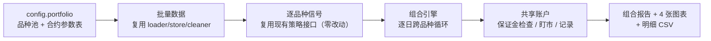

# 10 · 增量设计与任务列表 · v1.2（组合引擎：多品种并行 + 组合汇总）

> **文档性质**：设计方案（**待评审**）。评审通过后按任务列表落地实施，完成后进入验收。
> **前置文档**：`docs/07-框架补齐路线图.md`（T1.2-1 ~ T1.2-6）、`docs/09-验收报告-v1.1.md`
> **需求基线**（2026-10-10 两轮访谈锁定）：**共享资金池** + **10 万元** + **8 个中小合约（4 板块）** + **组合回测与报告**（组合模式内不含逐品种体检）
> **生成日期**：2026-10-10

---

## 1. 目标与范围

### 1.1 一句话目标

把当前「单品种 · 固定 1 手 · 无保证金约束」的回测，升级为「**多品种并行 · 共用一份资金 · 带保证金占用与拒绝开仓约束**」的组合引擎，一条命令产出组合级回测报告。

### 1.2 本期范围（做）

| 对应路线图任务 | 内容 |
|---|---|
| T1.2-1 | 品种池配置 + 批量数据获取/缓存（复用数据层，品种防呆沿用） |
| T1.2-2 | 多品种并行回测（新增组合引擎，逐日跨品种循环） |
| T1.2-3 | 共享资金池：保证金占用、可用资金约束（不足则拒绝开仓 + 事件日志）、头寸规模三模式 |
| T1.2-4 | 每日盯市/结算近似口径（日终 MTM、保证金重估），口径写入文档与报告 |
| T1.2-5 | 组合报告：组合汇总 + 逐品种汇总 + 相关性 + 贡献分解 + 保证金占用，4 张图表 |
| T1.2-6 | 主连拼接与换月口径说明（登记为数据口径风险；不做换月损益模拟） |

### 1.3 本期不做（明确边界）

- **逐品种体检 / 样本外汇总**：体检继续走单品种流程（`run_backtest.py`）；组合模式不重复跑（后续可加开关）
- **真实换月损益模拟**：需要主力合约映射与合约级数据，超出本期
- **组合层风控规则**（止损、熔断、压力测试）→ v1.3
- **分钟级、实盘/仿真** → v2.0

## 2. 需求基线（2026-10-10 锁定）

| 维度 | 结论 | 说明 |
|---|---|---|
| 资金模型 | **共享资金池** | 单账户、保证金共享、可用资金不足拒绝开仓；与实盘/SimNow 单账户一致 |
| 初始资金 | **100,000 元**（可配） | 8 手全开约占保证金 40%，留 60% 缓冲 |
| 品种池 | **8 个中小合约 · 4 板块** | 见 §3.4 合约参数表（已按 2026-10-10 实时数据核对） |
| 组合能力 | 组合回测 + 报告 | 不含逐品种 OOS/体检；运行约 30 秒内（数据缓存后） |
| 成本模型 | 手续费按手 + 滑点按跳（逐品种参数化） | 近似口径，见 §3.4 |

## 3. 架构设计

### 3.1 总体原则

- **旁路增强**：单品种链路（`run_backtest.py`、回测引擎、体检模块、既有 39 个测试）**零改动**；
- **新链路独立**：新增 `run_portfolio.py` 一键入口 + 组合引擎 + 组合报告，互不干扰；
- **口径统一**：成交约定沿用「**T 日收盘信号 → T+1 开盘价 ± 滑点**」（防未来函数）；成本口径与单品种一致（手续费按手、滑点按跳）。

### 3.2 数据流



### 3.3 组合引擎（核心）

**新增模块 `src/engine/portfolio_engine.py` + `src/engine/account.py`**：

1. **事件循环**：把 8 个品种的 bar 合并为统一事件流（按日期排序），逐事件处理：
   - 某品种当日有 bar 且存在待执行信号（其前一根 bar 产生）→ 计算目标手数 → **资金检查** → 成交（T+1 开盘价 ± 滑点）；
   - 日终：所有持仓按各品种最新收盘价盯市（MTM），保证金占用按最新收盘价重估，记录组合权益。
2. **共享账户（`PortfolioAccount`）**：
   - `cash`（现金）＝ 初始资金 ＋ 已实现盈亏 － 手续费；
   - `margin_used` ＝ Σ（|手数| × 最新价 × 乘数 × 保证金率）（按收盘价重估，**近似口径**）；
   - `available ＝ equity － margin_used`；开仓/加仓前检查 **新增保证金 ≤ available**，不足则**拒绝该笔开仓**并记录事件（日期/品种/需要/可用）；
   - `equity ＝ cash ＋ Σ 浮动盈亏`。
3. **约束口径（v1.2 简化）**：
   - 拒绝 = 整笔拒绝（不做部分成交/降级执行，降级留给 v1.3 风控）；
   - 平仓永不拒绝；浮亏导致可用资金为负时记录「保证金不足告警」（不强平，v1.3 处理）；
   - 每个品种独立交易日历（缺日 = 不交易，持仓沿用最近收盘价盯市）。

### 3.4 合约参数表（2026-10-10 数据核对）

数据源：akshare `futures_comm_info`（主力合约，交易所保证金口径）＋ 交易所标准合约参数。**首版写入 config，可覆盖；实现时提供校验脚本**。

| 板块 | 代码 | 名称 | 参考现价 | 乘数 | 最小变动 | 保证金率 | 单手保证金 | 手续费（近似） |
|---|---|---|---|---|---|---|---|---|
| 黑色 | RB0 | 螺纹钢 | 3,080 | 10 吨/手 | 1 元 | 7% | ≈ 2,156 元 | ≈ 3.1 元/手（万分之 1） |
| 黑色 | I0 | 铁矿石 | 683.5 | 100 吨/手 | 0.5 元 | 8% | ≈ 5,468 元 | ≈ 6.8 元/手（万分之 1） |
| 农产品 | M0 | 豆粕 | 3,389 | 10 吨/手 | 1 元 | 7% | ≈ 2,372 元 | 1.5 元/手 |
| 农产品 | P0 | 棕榈油 | 9,662 | 10 吨/手 | 2 元 | 8% | ≈ 7,730 元 | 2.5 元/手 |
| 农产品 | SR0 | 白糖 | 5,480 | 10 吨/手 | 1 元 | 6% | ≈ 3,288 元 | 2 元/手 |
| 能化 | MA0 | 甲醇 | 3,819 | 10 吨/手 | 1 元 | 9% | ≈ 3,437 元 | ≈ 3.8 元/手（万分之 1） |
| 能化 | TA0 | PTA | 6,704 | 5 吨/手 | 2 元 | 7% | ≈ 2,346 元 | 3 元/手 |
| 有色 | AL0 | 沪铝 | 23,380 | 5 吨/手 | 5 元 | 11% | ≈ 12,859 元 | 3 元/手 |
| **合计（各 1 手）** | | | | | | | **≈ 39,656 元（占资金 40%）** | |

> 对照（本期不纳入）：黄金 au ≈ 143,856 元/手、沪铜 cu ≈ 60,286 元/手——单手即占资金 6 成/3 成，与「10 万小资金」不相容，故排除。
> 口径说明：保证金率为**交易所口径**（实盘期货公司通常上浮 2–5 个百分点，config 可调）；手续费混合「元/手与万分比」统一近似为**固定元/手**；平今差异忽略。

### 3.5 头寸规模（`src/engine/sizing.py`）

三模式（config 切换）；**默认 `fixed`（每品种 1 手）**，保证首版组合结果直观可解释：

| 模式 | 公式 | 说明 |
|---|---|---|
| `fixed`（默认） | 每品种固定 `lots` 手（默认 1） | 与单品种口径一致 |
| `equal_weight` | 保证金预算 `B_i ＝ capital × (1/N) × 使用率上限`；`lots_i ＝ floor(B_i ÷ 单手保证金)` | 等权资金分配，手数受上限截断 |
| `inv_vol` | 权重 `w_i ∝ 1/σ_i`（σ＝该品种近 60 日收盘价收益波动）；同上式折算手数 | 波动率倒数（风险均衡雏形） |

> 手数在信号变化时按当日收盘数据计算、次日开盘执行；`使用率上限`默认 0.6（全开时保证金占用目标 ≤60%）；小资金下 floor 后多为 1 手，属预期（报告注明）。

### 3.6 组合报告（`src/report/portfolio_report.py` + `portfolio_plot.py`）

**文本报告**（`output/reports/portfolio_report.txt`）：

```
============= 组合回测报告 =============
  资金 / 区间 / 品种池 / 成本口径
--- 组合汇总（复用现有指标口径）---
  累计收益 / 年化 / 最大回撤 / 夏普 / 交易总数
  保证金：均值占用 / 峰值占用 / 峰值利用率 / 约束触发次数
--- 逐品种汇总 ---
  代码 名称 | 收益 | 回撤 | 夏普 | 交易次数 | 盈亏贡献 | 贡献占比
--- 相关性矩阵（逐品种策略日收益）---
--- 约束事件（拒绝开仓，前 10 条）---
--- 口径说明（换月拼接 / 保证金 / 盯市 / 手续费）---
```

**图表**（4 张，`output/figures/`）：

| 图 | 内容 |
|---|---|
| `portfolio_equity.png` | 组合权益曲线 + 回撤（双面板） |
| `portfolio_correlation.png` | 品种相关性热力图 |
| `portfolio_contribution.png` | 品种盈亏贡献条形图（红涨绿跌） |
| `portfolio_margin.png` | 保证金占用与利用率曲线（含资金线） |

**明细 CSV**：`portfolio_daily.csv`（逐日权益/保证金/可用资金）、`portfolio_symbols.csv`（逐品种汇总）、`portfolio_events.csv`（约束事件）。

### 3.7 换月与拼接口径（T1.2-6）

- 回测使用各品种**主力连续（拼接）序列**——换月点存在价格跳空，持仓跨越换月时损益含拼接噪声；
- 本期处理：报告「口径说明」登记为数据口径风险，**不做**换月损益模拟与换月点自动标注（精确标注需主力合约映射数据，列入后续）；
- 不把拼接跳空归因为策略能力（体检口径同样适用）。

### 3.8 配置结构（示例）

```yaml
portfolio:
  initial_capital: 100000          # 共享资金池
  sizing:
    mode: fixed                    # fixed | equal_weight | inv_vol
    lots: 1                        # fixed 模式：每品种手数
    target_margin_usage: 0.6       # equal_weight / inv_vol：保证金使用率上限
    vol_window: 60                 # inv_vol：波动率窗口（交易日）
    max_lots_per_symbol: 10        # 单品种手数上限
  symbols:
    - { code: RB0, strategy: dual_ma, params: { fast: 5, slow: 20 } }
    - { code: I0,  strategy: dual_ma, params: { fast: 5, slow: 20 } }
    - { code: M0,  strategy: dual_ma, params: { fast: 5, slow: 20 } }
    - { code: P0,  strategy: dual_ma, params: { fast: 5, slow: 20 } }
    - { code: SR0, strategy: dual_ma, params: { fast: 5, slow: 20 } }
    - { code: MA0, strategy: dual_ma, params: { fast: 5, slow: 20 } }
    - { code: TA0, strategy: dual_ma, params: { fast: 5, slow: 20 } }
    - { code: AL0, strategy: dual_ma, params: { fast: 5, slow: 20 } }
  contracts:                       # 合约与成本参数（近似口径，可覆盖）
    RB0: { multiplier: 10, tick_size: 1.0, margin_rate: 0.07, commission_per_lot: 3.1 }
    I0:  { multiplier: 100, tick_size: 0.5, margin_rate: 0.08, commission_per_lot: 6.8 }
    M0:  { multiplier: 10, tick_size: 1.0, margin_rate: 0.07, commission_per_lot: 1.5 }
    P0:  { multiplier: 10, tick_size: 2.0, margin_rate: 0.08, commission_per_lot: 2.5 }
    SR0: { multiplier: 10, tick_size: 1.0, margin_rate: 0.06, commission_per_lot: 2.0 }
    MA0: { multiplier: 10, tick_size: 1.0, margin_rate: 0.09, commission_per_lot: 3.8 }
    TA0: { multiplier: 5,  tick_size: 2.0, margin_rate: 0.07, commission_per_lot: 3.0 }
    AL0: { multiplier: 5,  tick_size: 5.0, margin_rate: 0.11, commission_per_lot: 3.0 }
```

## 4. 任务列表（T1.2-1 ~ T1.2-6 细化）

| # | 子任务 | 交付物 | 依赖 |
|---|---|---|---|
| T1.2-1a | `portfolio` 配置段 + 读取与校验（品种防呆、参数完整性） | `config.yaml`、`utils/config_loader.py` 扩展 | — |
| T1.2-1b | 批量数据加载（8 品种拉取/缓存/清洗，复用数据层） | `run_portfolio.py` 数据段 | T1.2-1a |
| T1.2-2a | 组合账户 `PortfolioAccount`（现金/保证金/可用/权益/记录） | `src/engine/account.py` | — |
| T1.2-2b | 组合引擎（逐日跨品种事件循环、T+1 成交约定） | `src/engine/portfolio_engine.py` | T1.2-2a |
| T1.2-3a | 头寸规模三模式 | `src/engine/sizing.py` | — |
| T1.2-3b | 资金约束（拒绝开仓 + 事件日志 + 告警） | 并入 T1.2-2a/b | T1.2-2a |
| T1.2-4a | 盯市与保证金重估口径 + 记录 | 并入 T1.2-2a（口径写入文档） | T1.2-2a |
| T1.2-5a | 组合报告文本 + 明细 CSV | `src/report/portfolio_report.py` | T1.2-2b |
| T1.2-5b | 4 张组合图表 | `src/report/portfolio_plot.py` | T1.2-2b |
| T1.2-5c | 一键入口 | `run_portfolio.py` | 全部 |
| T1.2-6 | 换月/拼接口径说明（报告章节 + 文档） | 报告与 docs 更新 | — |
| 收尾 | 测试、CHANGELOG、README、版本 1.2.0 | — | 全部 |

## 5. 验收标准（对 docs/07 验收线的细化）

1. `uv run python run_portfolio.py` 一键跑通：8 品种 → 组合报告 + 4 图 + 3 个 CSV，数据缓存后约 **30 秒内**；
2. **财务一致性**：`组合权益 ≡ 现金 ＋ Σ浮动盈亏`、`Σ逐品种盈亏贡献 ≡ 组合总盈亏`（单测断言闭合）；
3. **约束可复现**：构造小资金场景（如把资金调低）能触发「拒绝开仓」，事件出现在报告与 CSV；
4. **成交约定**：抽查信号与成交日，满足「T 日信号 → T+1 开盘价 ± 滑点」；
5. **零回归**：单品种链路（39 测试 + `run_backtest.py` 输出）不变；CI 全绿；新增模块均有单测。

## 6. 测试计划（新增约 14 个）

| 测试文件 | 覆盖 |
|---|---|
| `tests/test_account.py` | 保证金计算、可用资金、拒绝开仓、权益闭合、盯市重估 |
| `tests/test_sizing.py` | 三模式手数计算（含 floor / 上限 / 波动率倒数权重） |
| `tests/test_portfolio_engine.py` | 双品种小样本端到端、日历缺失日、T+1 成交、翻仓、约束事件 |
| `tests/test_portfolio_report.py` | 报告渲染与 CSV 冒烟（含空事件） |

## 7. 风险与开放项

| # | 项 | 说明 |
|---|---|---|
| R1 | 保证金率/手续费为**近似口径** | 交易所口径 + 固定元/手近似；config 可调，报告注明 |
| R2 | 主连拼接（换月跳空） | 报告登记为口径风险；换月损益模拟列入后续 |
| R3 | 首次运行需联网拉取 7 个新品种数据 | 之后走本地缓存（约 10–30 秒/品种） |
| R4 | 小资金下分配类模式手数取整退化 | floor 后多为 1 手；报告注明，加大资金可体验 |
| R5 | 拒绝开仓后不再补单 | v1.2 简化口径；降级执行/重试列入 v1.3 风控 |

**评审时确认项**（不阻塞，默认按建议执行）：① 头寸规模默认 `fixed`（1 手）——建议保留，首版结果最直观；② 组合报告不逐品种画权益曲线（保持简洁）——建议采纳。

## 8. 实施顺序（批准后执行，预计 3 个实施轮次）

1. **轮 1 · 数据与账户**：T1.2-1 + T1.2-2a + T1.2-3a（配置、数据、账户、sizing + 单测）
2. **轮 2 · 引擎与约束**：T1.2-2b + T1.2-3b + T1.2-4（组合引擎、约束、盯市 + 端到端单测）
3. **轮 3 · 报告与收尾**：T1.2-5 + T1.2-6 + 测试补齐、文档、验收准备（随后按 v1.0/v1.1 体例出验收报告）

> 完成后进入验收流程（QA 报告 → 用户确认 → 提交推送），与 v1.1 相同。

---

*合规声明：投资有风险，本内容仅供研究与教育，不构成投资建议；回测结果不等于实盘表现。*
